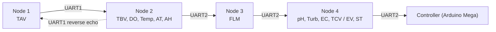

---

title: Node Topology

description: The ESP32 node chain from Node 1 to Node 4 and the downstream controller, with UART assignments, GPIO assignments, a pin-conflict warning and node roles.

---

# Node Topology

## The chain



All links are **9600 baud, 8N1** over `HardwareSerial`.

The upstream direction is a simple line: each node receives a frame, appends its

own fields, and forwards it. The one return path is Node 2 → Node 1, which

carries a subset of Node 2's measurements for Node 1's own display.

Node 4's UART2 pins are commented `// To Controller (Mega)` in the source — the

downstream controller is not an ESP32 node in this firmware and has no code here.

## Node roles

| Node | Role in the chain | Measurements contributed | Display | Reverse path |

|---|---|---|---|---|

| Node 1 | **Cluster head.** Originates the upstream frame | `TAV` | 16×4 I2C LCD at `0x27` | Receives the Node 2 echo |

| Node 2 | Mid-chain. Appends its fields, forwards onward, echoes back | `TBV`, `DO`, `Temp`, `AT`, `AH` | None | Sends echo on UART1 |

| Node 3 | Mid-chain. Appends flow; substitutes a fallback frame on upstream timeout | `FLM` | None | None |

| Node 4 | **Cluster tail.** Terminates the chain, cleans the upstream packet, forwards to the controller | `pH`, `Turb`, `EC`, `TCV` (or `EV`, `ST` in the SMTP build) | 16×4 I2C LCD at `0x27` | None |

> **Not verified from the current source.** There is no LCD defined on Node 2 or

> Node 3 in either pin map, and no physical enclosure artwork, schematic or

> hardware photograph in the repository. How nodes are distinguished in the

> field is a labelling exercise — see

> <a href="../field-service/node-identification.html">Node Identification</a>.

## UART assignments per node

UART numbering is **device-local**. The same UART number means a different

physical GPIO pair on a different board.

| Node | UART | Role | RX GPIO | TX GPIO |

|---|---|---|---|---|

| Node 1 | UART1 | to/from Node 2 | 32 | 33 |

| Node 2 | UART1 | to/from Node 1 | 25 | 26 |

| Node 2 | UART2 | to/from Node 3 | 32 | 33 |

| Node 3 | UART1 | to/from Node 2 | 25 | 26 |

| Node 3 | UART2 | to/from Node 4 | 32 | 33 |

| Node 4 | UART1 | to/from Node 3 | 25 | 26 |

| Node 4 | UART2 | to/from the controller | 32 | 33 |

A practical consequence: **the two ends of every link use the same GPIO pair but

viewed from opposite boards**, so a field link is always *TX of one board to RX

of the other*, 9600 8N1, and the grounds must be common.

## Full GPIO map

Verbatim from the `#define` blocks in each sketch.

### Node 1 — `Node1.ino` lines 10–17

| Signal | GPIO | Direction |

|---|---|---|

| N1 ultrasonic TRIG | 2 | out |

| N1 ultrasonic ECHO | 17 | in |

| UART1 RX (from N2) | 32 | in |

| UART1 TX (to N2) | 33 | out |

| LCD SDA | 21 | — |

| LCD SCL | 22 | — |

### Node 2 — `Node2.ino` lines 12–20

| Signal | GPIO | Direction |

|---|---|---|

| DS18B20 water temp | 4 | 1-Wire |

| DO analog | 34 | in (ADC1) |

| N2 ultrasonic TRIG | 16 | out |

| N2 ultrasonic ECHO | 17 | in |

| DHT11 | 27 | in |

| UART1 RX (from N1) | 25 | in |

| UART1 TX (to N1) | 26 | out |

| UART2 RX (from N3) | 32 | in |

| UART2 TX (to N3) | 33 | out |

### Node 3 — `Node3.ino` lines 6–10

| Signal | GPIO | Direction |

|---|---|---|

| Flow sensor pulse | 23 | in, `INPUT_PULLUP`, ISR on **FALLING** |

| UART1 RX (from N2) | 25 | in |

| UART1 TX (to N2) | 26 | out |

| UART2 RX (from N4) | 32 | in |

| UART2 TX (to N4) | 33 | out |

### Node 4 — `Node4.ino` lines 13–27 (identical map in `Node4_SMTP`)

| Signal | GPIO | Direction |

|---|---|---|

| Effluent ultrasonic TRIG | 4 | out |

| Effluent ultrasonic ECHO | 2 | in |

| pH analog | 13 | in (ADC2) |

| Turbidity analog | 14 | in (ADC2) |

| EC analog | 12 | in (ADC2) |

| Submerged DS18B20 | 27 | 1-Wire |

| DHT11 | 5 | in |

| UART1 RX (from N3) | 25 | in |

| UART1 TX | 26 | out |

| UART2 RX (from controller) | 32 | in |

| UART2 TX (to controller) | 33 | out |

| LCD SDA | 21 | — |

| LCD SCL | 22 | — |

```cpp

--8<-- "assets/snippets/node2-pin-definitions.cpp"

```

<div class="cirqua-source">

<span class="cirqua-source__label">Source</span>

<a href="https://github.com/lestealthy/Cirqua/blob/db6d9b896341a9c7d8fd01913e854b663c110d55/FreeRTOS_Implementation/Node2/Node2.ino">lestealthy/Cirqua</a> ·

<code>FreeRTOS_Implementation/Node2/Node2.ino</code> ·

pin <code>#define</code> block ·

lines 10–32 · commit <code>db6d9b8</code>
</div>

## GPIO reuse warning

!!! danger "Pin numbers do not identify a wire"

    **GPIO 17 is used by both Node 1 and Node 2** — as an ultrasonic **ECHO**

    input on each. **GPIO 2 is Node 1's ultrasonic TRIG but Node 4's ultrasonic

    ECHO.** GPIO 4 is Node 2's DS18B20 data line but Node 4's ultrasonic TRIG.

    GPIO 27 is Node 2's DHT11 and Node 4's DS18B20.

    Pin reuse across boards is expected and harmless *because the boards are

    physically separate*. It becomes a fault the moment two boards are wired

    together by matching numbers.

> **Recommendation:** label both ends of every inter-node cable with the node

> identifiers (`N1`…`N4`) as well as the pin function, and treat the node

> identifier as the primary key. Never terminate a link by pin number alone.

## Tank geometry, per node

Tank geometry is **not** shared. Each node has its own constants and its own

ultrasonic timeout.

| Node | Tank role | `TANK_HEIGHT` cm | `TANK_RADIUS` cm | Ultrasonic timeout µs |

|---|---|---|---|---|

| 1 | Collection Tank A (TAV) | 260.0 | 110.0 | 30000 |

| 2 | Feeding Tank B (TBV) | 178.0 | 59.5 | 20000 |

| 4 | Effluent (TCV / EV) | 178.0 | 59.5 | 25000 |

Volume is computed from the cylinder: `π r² h / 1000` with `3.14159f`, using the

time-of-flight constant `0.0343f` cm/µs halved for the round trip.

## Continue

* <a href="data-flow.html">Data Flow</a> — what each hop adds to the frame

* <a href="../hardware/gpio-map.html">Hardware: GPIO Map</a> — full pin listing

* <a href="../hardware/wiring.html">Hardware: Wiring</a>

* <a href="../nodes/index.html">Nodes</a> — per-node detail

