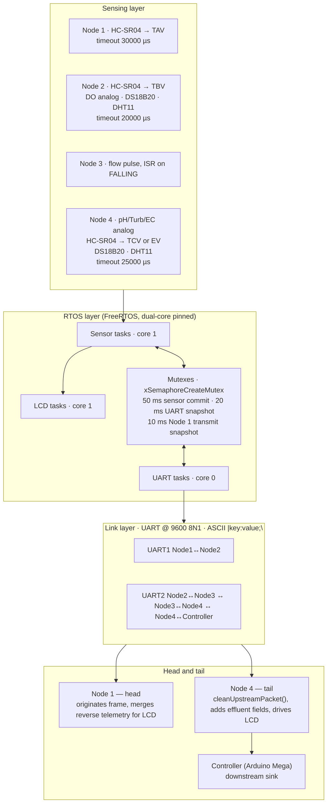

---

title: System Architecture

description: Layered architecture of the ESP32 node chain — sensing, RTOS, serial link and node head/tail layers, with the full FreeRTOS task table.

---

# System Architecture

## The execution model

> **Important:** `setup()` and `loop()` are **not** the runtime. Each sketch's

> `setup()` creates its FreeRTOS tasks with `xTaskCreatePinnedToCore`, and

> `loop()` immediately calls `vTaskDelete(NULL)` to reclaim the Arduino loop

> task. From that point on all work happens inside pinned FreeRTOS tasks driven

> by `vTaskDelayUntil`.



## The FreeRTOS task table

Verbatim `xTaskCreatePinnedToCore` arguments.

| Node | Task name | Function | Stack | Prio | Core | Period |

|---|---|---|---|---|---|---|

| 1 | `N1_Sensors` | `Task_Sensors_Node1` | 3072 | 2 | 1 | 500 ms |

| 1 | `N1_UART` | `Task_UART_Node1` | 3072 | 3 | 0 | 1 ms loop |

| 1 | `N1_LCD` | `Task_LCD_Node1` | 3072 | 1 | 1 | 500 ms |

| 2 | `N2_Sensors` | `Task_Sensors_Node2` | 4096 | 2 | 1 | 1000 ms |

| 2 | `N2_UART` | `Task_UART_Node2` | 4096 | 3 | 0 | 50 ms |

| 3 | `N3_Flow` | `Task_Flow_Node3` | 3072 | 2 | 1 | 1000 ms |

| 3 | `N3_UART` | `Task_UART_Node3` | 3072 | 3 | 0 | 50 ms |

| 4 | `N4_Sensors` | `Task_Sensors_Node4` | 4096 | 2 | 1 | 1000 ms |

| 4 | `N4_UART` | `Task_UART_Node4` | 4096 | 3 | 0 | 50 ms |

| 4 | `N4_LCD` | `Task_LCD_Node4` | 3072 | 1 | 1 | 500 ms |

| 4 SMTP | `N4_Sensors` | `Task_Sensors_Node4` | 4096 | 2 | 1 | 1000 ms |

| 4 SMTP | `N4_EmailUART` | `Task_Email_And_UART_Node4` | **5120** | 3 | 0 | 50 ms |

| 4 SMTP | `N4_LCD` | `Task_LCD_Node4` | 3072 | 1 | 1 | 500 ms |

The pattern is consistent: **sensor acquisition and display on core 1, UART

handling on core 0, UART tasks always at the highest priority (3)**. The SMTP

variant gives its combined UART/e-mail task a larger stack (5120) than the plain

`Node4` UART task (4096), because it also drives the mail client.

## Synchronisation

All mutexes are created with `xSemaphoreCreateMutex()`. A creation failure calls

`systemFatalTrap`, which halts the node; `systemFatalTrap` uses `vTaskDelay`

rather than a busy loop, so other tasks still get scheduled while the trap is in

progress.

| Node | Mutexes |

|---|---|

| Node 1 | `xLocalDataMutex`, `xNode2DataMutex` |

| Node 2 | `xSensorsMutex`, `xN1DataMutex`, `xN3DataMutex` |

| Node 3 | `xFlowMutex` |

| Node 4 and Node 4 SMTP | `xLocalN4Mutex` |

Mutex acquisition uses bounded waits rather than blocking indefinitely:

| Lock timeout | Applies to |

|---|---|

| 50 ms | Sensor commit |

| 20 ms | UART snapshot |

| 10 ms | Node 1 transmit snapshot |

Node 3 additionally protects its shared 32-bit `g_pulseCount` with a

`portMUX_TYPE` and `portENTER_CRITICAL` / `portEXIT_CRITICAL` rather than a

mutex, because the counter is updated from an `IRAM_ATTR pulseISR()` on the

**falling** edge of GPIO 23. `g_pulseCount` is `volatile uint32_t`.

```cpp

--8<-- "assets/snippets/node3-pulse-isr.cpp"

```

<div class="cirqua-source">

<span class="cirqua-source__label">Source</span>

<a href="https://github.com/lestealthy/Cirqua/blob/db6d9b896341a9c7d8fd01913e854b663c110d55/FreeRTOS_Implementation/Node3/Node3.ino">lestealthy/Cirqua</a> ·

<code>FreeRTOS_Implementation/Node3/Node3.ino</code> ·

<code>pulseISR()</code> ·

lines 15–23 · commit <code>db6d9b8</code>
</div>

## Layer 1 — sensing

Measurement duties per node:

| Node | Measurements | Notes |

|---|---|---|

| 1 | Tank A volume from an HC-SR04 time-of-flight | 30000 µs timeout; level clamped to `[0, TANK_HEIGHT]`; **computed volume is doubled** before the integer cast |

| 2 | Tank B volume (HC-SR04), dissolved oxygen (analog, GPIO 34, ADC1, 12-bit), water temperature (DS18B20), ambient temperature and humidity (DHT11) | 20000 µs ultrasonic timeout; DO reported in mg/L with a temperature-compensation factor |

| 3 | Flow rate from a pulse input | Free-running `uint32_t` pulse counter, `FLOW_CAL_FACTOR 5.5f` pulses per litre, reported in L/min |

| 4 | pH, turbidity and EC (analog, ADC2), effluent volume (HC-SR04), submerged temperature (DS18B20), ambient temperature and humidity (DHT11) | 25000 µs ultrasonic timeout; distances outside `0 … TANK_HEIGHT + 20` are rejected |

Node 1 pin definitions, verbatim from the sketch:

```cpp

--8<-- "assets/snippets/node1-pin-definitions.cpp"

```

<div class="cirqua-source">

<span class="cirqua-source__label">Source</span>

<a href="https://github.com/lestealthy/Cirqua/blob/db6d9b896341a9c7d8fd01913e854b663c110d55/FreeRTOS_Implementation/Node1/Node1.ino">lestealthy/Cirqua</a> ·

<code>FreeRTOS_Implementation/Node1/Node1.ino</code> ·

pin <code>#define</code> block ·

lines 5–35 · commit <code>db6d9b8</code>
</div>

## Layer 3 — link

Every inter-node link is the same contract: `HardwareSerial`, `INTERNODE_BAUD`

of 9600, `SERIAL_8N1`. Which UART and which GPIO pair is used is decided

per node; see <a href="node-topology.html">Node Topology</a>.

Receive buffers are sized per node, and this matters when reasoning about frame

drops:

| Location | Buffer |

|---|---|

| Node 1 | `String` with a 256-byte cap, reset at 250 |

| Node 2 | `char[128]` per link |

| Node 3 | `char[256]` |

| Node 4 | `char[384]`, assembled packet `char[512]` |

On overflow a receiver resets its index, which **drops the frame in progress**.

## Layer 4 — head and tail

**Node 1 (head)** originates the upstream frame and holds the reverse telemetry

it receives from Node 2 so it can display the full picture locally. Its LCD is

16×4 I2C at address `0x27` and carries a ten-level status precedence, from

`WAITING` through `ERROR` to `NORMAL` — see

<a href="../nodes/node1.html">Node 1</a>.

**Node 4 (tail)** terminates the chain. It runs `cleanUpstreamPacket()` to strip

the upstream `AT:` and `AH:` tokens, appends its own effluent fields, drives the

16×4 I2C LCD at `0x27`, and forwards the assembled packet over UART2 to the

downstream controller — the pins annotated `// To Controller (Mega)`.

```cpp

--8<-- "assets/snippets/node4-packet-cleaner.cpp"

```

<div class="cirqua-source">

<span class="cirqua-source__label">Source</span>

<a href="https://github.com/lestealthy/Cirqua/blob/db6d9b896341a9c7d8fd01913e854b663c110d55/FreeRTOS_Implementation/Node4/Node4.ino">lestealthy/Cirqua</a> ·

<code>FreeRTOS_Implementation/Node4/Node4.ino</code> ·

<code>cleanUpstreamPacket()</code> ·

lines 936–990 · commit <code>db6d9b8</code>
</div>

## The legacy tree is not this architecture

The repository also contains `_OLD/`, including a `cirqua.ino` and single-file

`node*_fixed` sketches. Those are **historical / legacy — not the current

firmware architecture**. Nothing in `_OLD/` describes the system documented here.

See <a href="../historical/legacy-firmware.html">Legacy Firmware</a>.

## Continue

* <a href="node-topology.html">Node Topology</a> — the chain, UARTs and pins

* <a href="data-flow.html">Data Flow</a> — what a frame contains at each hop

* <a href="communications.html">Communications</a> — the link contract

* <a href="timing.html">Timing</a> — periods, timeouts and staleness

* <a href="../rtos/tasks.html">RTOS: Tasks</a> — task-level detail

* <a href="../firmware/source-map.html">Firmware: Source Map</a> — file-by-file

