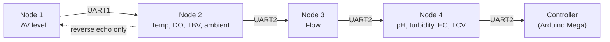

# System explorer

The chain below is **generated from the pinned firmware**, not drawn by hand. The
node order, the measured quantities, the sensor GPIOs and the UART assignments are
re-read from the sketches at commit `db6d9b8` on every build, so the diagram cannot
drift from the code.

Select a node to see what it measures, how it is wired and how far it has been
verified. Each entry is also a direct link to that node's full manual.

--8<-- "assets/generated/system-explorer.html"

## What the chain actually does

Telemetry flows **upstream only**, from Node 1 to the controller, with a single
reverse echo from Node 2 back to Node 1 so the cluster head can display the values
it did not measure itself.

Each node appends its own fields to the frame it received and passes the result on,
so by the time the frame leaves Node 4 it carries every measurement in the chain.
The full field-by-field description is on [Message format](../communication/message-format.md).

## Why the reverse echo exists

Node 1 is the only node with a display in the tank where the operator stands, but it
measures only tank level. Node 2 echoes its own values back to Node 1 over the same
UART so the head display can show dissolved oxygen, water temperature and the
ambient pair without needing a second display.

That echo is the only reverse traffic in the system. There is no reverse path from
Node 3 or Node 4.

  Photo required
  
No physical chain photograph exists

  

    No photograph of the installed CIRQUA chain was found in the firmware repository
    or the local workspace. This slot is deliberately left as a placeholder rather
    than filled with a stock or generated image, which would misrepresent the
    hardware. Photographs will be added here when a bench or commissioning record
    exists.
  

## Related pages

* [Node topology](node-topology.md) — links, directions and the pin-pair convention
* [Data flow](data-flow.md) — how one frame travels the chain
* [System architecture](system-architecture.md) — layered view and task structure
* [Timing](timing.md) — sampling periods, poll cadence and timeout behaviour
* [Field service](../field-service/index.md) — practical access to each node
* [Known limitations](../validation/known-limitations.md) — what remains unverified