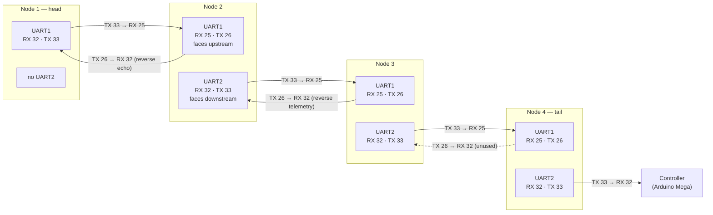

# Serial Links

**Firmware implementation.** Every inter-node link is an ESP32 hardware UART
running at **`INTERNODE_BAUD 9600`** with **`SERIAL_8N1`** framing. There are
no parity bits, no flow control and no modem control lines. The debug console on
each node is a separate port at **115200 baud** and is not part of the chain.

## Physical link table

UART instance and pin assignments are taken verbatim from the `#define` blocks.

| # | Link | Upstream node | Downstream node | Direction of data | Baud | Framing | UART instance | TX GPIO | RX GPIO |
|---|---|---|---|---|---|---|---|---|---|
| 1 | Node 1 → Node 2 | Node 1 | Node 2 | upstream telemetry | 9600 | 8N1 | Node 1 **UART1**, Node 2 **UART1** | N1 **33** | N2 **25** |
| 2 | Node 2 → Node 1 | Node 2 | Node 1 | reverse echo | 9600 | 8N1 | Node 2 **UART1**, Node 1 **UART1** | N2 **26** | N1 **32** |
| 3 | Node 2 → Node 3 | Node 2 | Node 3 | consolidated upstream | 9600 | 8N1 | Node 2 **UART2**, Node 3 **UART1** | N2 **33** | N3 **25** |
| 4 | Node 3 → Node 2 | Node 3 | Node 2 | reverse telemetry | 9600 | 8N1 | Node 3 **UART1**, Node 2 **UART2** | N3 **26** | N2 **32** |
| 5 | Node 3 → Node 4 | Node 3 | Node 4 | upstream + flow | 9600 | 8N1 | Node 3 **UART2**, Node 4 **UART1** | N3 **33** | N4 **25** |
| 6 | Node 4 → Node 3 | Node 4 | Node 3 | *no frame originates here* | 9600 | 8N1 | Node 4 **UART1**, Node 3 **UART2** | N4 **26** | N3 **32** |
| 7 | Node 4 → Controller | Node 4 | Controller (Arduino Mega) | full cluster packet | 9600 | 8N1 | Node 4 **UART2**, controller | N4 **33** | controller **32** |
| 8 | Controller → Node 4 | Controller | Node 4 | *reserved / calibration* | 9600 | 8N1 | Node 4 **UART2**, controller | controller **33** | N4 **32** |

Notes on the table:

* **Node 1 has no upstream link.** It is the head and starts the frame. Its
  UART2 is unused — the pin map assigns only UART1 on GPIO 32/33.
* **Node 3 uses no GPIO pair of its own beyond the two UART pairs.** Its only
  non-UART pin is the flow input on GPIO 23.
* **Node 4's UART2 is commented in the source as "To Controller (Mega)".** The
  downstream controller is an Arduino Mega; its own pin assignments are **not
  verified from the current source** — only the Node 4 side is.
* **Link 6** exists as a physical receive path on both nodes. Node 4 does not
  originate a frame towards Node 3, so in normal operation nothing is sent on it.
* The **calibration console** is on the debug `Serial` port at 115200 baud, not
  on either chain UART.

## The elegant part — reused pin pairs

**Firmware implementation.** Every node from Node 2 downstream uses the **same
two GPIO pairs**, with the meaning of each pair fixed by position in the chain:

| GPIO pair | Role on Nodes 2, 3 and 4 |
|---|---|
| **25 (RX) / 26 (TX)** | Always faces **upstream** — the node it receives from |
| **32 (RX) / 33 (TX)** | Always faces **downstream** — the node it sends to |

**Engineering interpretation.** Because the pin *numbers* repeat while the peer
at the other end changes, the connector on Node 2, Node 3 and Node 4 looks
identical from the outside. That is a genuine maintenance advantage — one pinout
memorised serves three boards — and a genuine hazard at the same time, because
nothing physical distinguishes "RX 25 towards the head" from "RX 25 towards the
tail". **Recommendation:** label connectors with the *peer node*, not with the
pin number. See <a href="../hardware/gpio-map.html">GPIO Map</a>.

## Framing

| Parameter | Value |
|---|---|
| Baud rate | **9600** (`INTERNODE_BAUD`) |
| Data bits | 8 |
| Parity | None |
| Stop bits | 1 |
| Flow control | **None** — no RTS/CTS anywhere |
| Byte order | Standard UART, LSB first per frame |

**Engineering interpretation.** Effective throughput is roughly **960 bytes per
second** at 8N1 (10 bits per byte). A realistic full packet is well under 200
bytes, so a frame takes of the order of 200 ms on the wire, and frames are
published at 2 Hz (Node 1 → Node 2) and 1 Hz downstream. The link is therefore
**heavily under-utilised** — which is a large part of why the protocol can
afford to be human-readable ASCII with no error detection.

**Recommendation.** The available headroom is the natural place to add a
checksum if the format ever needs hardening; the bandwidth cost of a 2-character
CRC on a 100-byte frame is negligible at this bit rate.

## Polling cadence

**Firmware implementation.**

| Node | UART task period | Poll rate |
|---|---|---|
| Node 1 | **1 ms** | 1000 Hz |
| Node 2 | 50 ms | 20 Hz |
| Node 3 | 50 ms | 20 Hz |
| Node 4 | 50 ms | 20 Hz |
| Node 4 SMTP | 50 ms | 20 Hz, shared with e-mail work |

The firmware is **polling**, not interrupt- or DMA-driven: each UART task reads
its port on a fixed period. **Engineering interpretation:** polling at 20 Hz
against a 9600 baud link is comfortable — up to ~48 bytes could arrive between
polls. Node 1's 1 ms loop is far more aggressive than the link needs; see
<a href="../rtos/scheduling.html">Scheduling</a>.

## Cabling, levels and earthing

> **Not verified from the current source.** Cable types, lengths, gauges,
> connector pinouts and keying. Nothing about the physical interconnect is
> recorded in the repository.

**Engineering interpretation.** All four nodes are 3.3 V devices, so every link
is a **3.3 V TTL UART** connection with no level shifting required between
nodes. The only level concerns in the system are the sensor inputs — see
<a href="../hardware/wiring.html">Wiring</a> — not the inter-node links.

**Recommendation — common ground is required.** A TTL UART is a single-ended
signal referenced to the two boards' grounds. Every node in the chain must share
a common ground with its neighbours. Bond the ground conductor through the
chain in the same cable as the data lines, and treat a missing or lifted ground
as a first suspect when a link behaves intermittently: it will present as
Node 1's `ERROR` status or as Node 3's timeout fallback.

**Recommendation — cable practice.**

* Keep each inter-node run as short as practical. At 9600 baud there is no
  bandwidth argument for long cables, but there is a noise-immunity argument
  against them.
* Prefer a cable that carries **all three conductors** — TX, RX and ground —
  between adjacent nodes.
* Do not run inter-node cables in parallel with, or in the same conduit as,
  mains or pump cabling.
* Do not daisy-chain a single signal pair through more than two nodes. The
  firmware expects a point-to-point link at each end, with a separate pair per
  hop.

## What must still be documented

> **Not verified from the current source.**
>
> * Cable type, length, gauge, core count, shielding and connector type for each
>   hop.
> * The downstream controller's pin assignments — only Node 4's side of the
>   controller link is recorded in the firmware.
> * Whether link 6 (Node 4 → Node 3) carries any traffic in the built system.
> * Whether a terminator or bias resistor is fitted anywhere on the chain.
> * Earthing, bonding and surge protection arrangement.

## Related pages

* <a href="message-format.html">Message Format</a> — what actually goes over
  these links.
* <a href="fault-handling.html">Fault Handling</a> — what happens when a link
  stops.
* <a href="../hardware/gpio-map.html">GPIO Map</a> — the authoritative pin
  assignments.
* <a href="../architecture/node-topology.html">Node Topology</a> — node roles in
  the chain.
