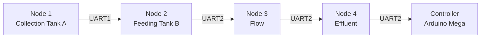

# Field Service

This section is written for a technician standing in front of a node, not at a desk.
It assumes you can read an LCD, use a USB-serial terminal and handle a multimeter.

Claim types used throughout: **Firmware implementation**, **Engineering
interpretation**, **Recommendation**.

## Safety first

!!! warning  Safety first

    **Isolate before you touch.** Before opening any enclosure or unplugging any sensor:

    - **Disconnect the power source first.** Do not work on a live node. Do not rely on
      the USB cable alone as your only isolation if the node is also mains or solar
      powered.
    - **Expect condensation.** Node 1's own firmware treats `>= 80 %` relative humidity
      and `>= 45 °C` ambient as alarm conditions (`HI HUMID`, `OVERTEMP`, `HOT+HUM`).
      Those thresholds exist because condensation is expected in this installation. Open
      an enclosure in a dry state, not immediately after a cold night.
    - **Do not disturb the water side unnecessarily.** Nodes sit on tanks. Removing a
      submerged probe drains or contaminates the sample.
    - **Discharge before wiring.** ESP32 GPIO pins are not 5 V tolerant. See the
      level-shift warning on the ultrasonic Echo line in
      [Sensor replacement](sensor-replacement.md).

    **There is no published schematic.** The firmware repository contains **no schematic
    files, no circuit diagrams and no wiring records**. The only authoritative
    connection information in this project is the GPIO `#define` maps, reproduced on
    [Hardware: GPIO map](../hardware/gpio-map.md) and on each node page. Do not rely
    on memory, and do not invent connections from a diagram you have not seen.

    > **Not verified from the current source.** Power supply voltage and topology,
    > regulator part numbers, enclosure dimensions and materials, IP rating, cable types
    > and lengths, and connector pinouts. None of these are published. Anything you
    > learn in the field must be recorded by you; it is not in the documentation.

## The QR workflow

Each node carries a QR code label that points at a single flat page — a permanent URL
with an `.html` extension, for example:

```text
https://lestealthy.github.io/Cirqua-documentation/nodes/node1.html
```

The intended workflow is:

1. **Scan** the QR code on the node with any phone or tablet camera application.
2. **Open the node page.** It identifies the node and lists its sensors, GPIO
   assignments, wiring, calibration constants and known failure modes.
3. **Use the node page as the index** into the rest of this documentation, which is
   organised by task rather than by node.
4. **Escalate** with the evidence listed in
   [Troubleshooting: escalation](troubleshooting.md#escalation) if the problem is not
   resolved from the node page.

The QR codes themselves are documented, with their target URLs, on
[QR codes](qr-codes.md). The images live in `assets/qr/`.

!!! note

    A scan is a convenience, not an identifier. **The protocol itself carries no node
    address** — see the honest finding in
    [Node identification](node-identification.md#the-protocol-has-no-node-addressing).

## The nodes

There are four physical nodes and **five** firmware builds: Node 4 exists in two
variants with materially different behaviour.

| Node | Role | Sensors | Display | Page |
|---|---|---|---|---|
| Node 1 | Collection Tank A (`TAV`); cluster head | HC-SR04 ultrasonic | 16×4 I2C LCD | [Node 1](../nodes/node1.md) |
| Node 2 | Feeding Tank B (`TBV`), dissolved oxygen, water and ambient temperature | DS18B20, DHT11, DO analogue, HC-SR04 | None | [Node 2](../nodes/node2.md) |
| Node 3 | Flow (`FLM`) | Flow sensor, pulse input | None | [Node 3](../nodes/node3.md) |
| Node 4 | Effluent (`TCV` / `EV`); cluster tail | pH, turbidity, EC, submerged DS18B20, DHT11, HC-SR04 | 16×4 I2C LCD | [Node 4](../nodes/node4.md) |
| Node 4 SMTP | Effluent, with Wi-Fi and e-mail reporting | As Node 4 | 16×4 I2C LCD | [Node 4 SMTP](../nodes/node4-smtp.md) |

The topology is a daisy chain. Each node talks to its neighbour on one link and, except
at the ends, forwards traffic in both directions:



**Engineering interpretation.** This matters for diagnosis: a break anywhere in the chain
removes data from **everything downstream of the break**. A dead Node 2 does not merely
lose `TBV` and `DO` — it stops Node 1 from receiving anything at all, which is why Node
1's LCD shows `ERROR`.

## Field-service pages

| Page | Use it when |
|---|---|
| [Node identification](node-identification.md) | You have a node in your hand and need to know which one it is |
| [Startup checklist](startup-checklist.md) | You have just powered a node, or you want to confirm a healthy node |
| [Troubleshooting](troubleshooting.md) | Something is wrong and you need to work out what |
| [Sensor replacement](sensor-replacement.md) | A sensor is being swapped out |
| [Maintenance](maintenance.md) | Periodic upkeep and record keeping |
| [QR codes](qr-codes.md) | You need the label artwork or the target URLs |

## Calibration, from the field

Two channels can be adjusted on a live Node 4 from the 115200-baud debug console; the
rest cannot.

| Channel | Adjustable on site? | Page |
|---|---|---|
| pH slope and offset | **Yes** — `SET:PH_S=`, `SET:PH_O=` | [pH calibration](../calibration/ph.md) |
| EC K-factor | **Yes** — `SET:EC_K=` | [Conductivity calibration](../calibration/conductivity.md) |
| Tank geometry | No — edit and re-flash | [Ultrasonic calibration](../calibration/ultrasonic.md) |
| Node 1 volume ×2 factor | No — edit and re-flash | [Ultrasonic calibration](../calibration/ultrasonic.md) |
| Dissolved oxygen | No — edit and re-flash | [Dissolved oxygen calibration](../calibration/dissolved-oxygen.md) |
| Turbidity | No constants exist | [Turbidity calibration](../calibration/turbidity.md) |
| Flow K-factor | No — edit and re-flash | [Flow](../sensors/flow.md) |

## What is not in this documentation

Be aware of these gaps before relying on this section:

- **No schematics.** See the safety admonition above.
- **No bill of materials.** The source names only HC-SR04, DS18B20 and DHT11; the DO,
  flow, pH and EC modules are unnamed.
- **No published maintenance schedule, consumable part numbers or calibration
  intervals.** The intervals on the [Maintenance](maintenance.md) page are
  recommendations, clearly labelled as such, and must be established by the project.
- **No hardware photographs.**
- **No confirmation that any node is deployed in the field.**

## Related pages

- [Architecture: system architecture](../architecture/system-architecture.md)
- [Hardware](../hardware/index.md)
- [Firmware: flashing](../firmware/flashing.md)
- [Validation: known limitations](../validation/known-limitations.md)