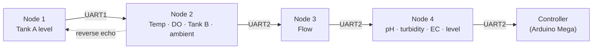

  
CIRQUA · Waterwise Futures

  <h1 class="cirqua-hero__title">Water monitoring hardware, documented to the source</h1>
  
Embedded monitoring and instrumentation platform — four ESP32 nodes on a UART chain

  

    Every GPIO assignment, task, protocol frame and calibration constant on this site is read from the
    pinned firmware revision, not described from memory. Where something is not verified it says so.
    This is the technical source of truth for the CIRQUA measurement chain: for field technicians
    standing in front of a node, and for engineers changing the firmware.
  

  

    <a class="cirqua-hero__btn cirqua-hero__btn--primary" href="architecture/system-explorer.html">Explore the system</a>
    <a class="cirqua-hero__btn cirqua-hero__btn--ghost" href="field-service/index.html">Field service</a>
    <a class="cirqua-hero__btn cirqua-hero__btn--ghost" href="firmware/index.html">Firmware</a>
    <a class="cirqua-hero__btn cirqua-hero__btn--ghost" href="references/index.html">Evidence</a>
  

--8<-- "assets/generated/site-revision-bar.html"

## The system

One telemetry frame originates at Node 1, gains fields at each node it passes, and leaves Node 4
for the controller. Node 2 echoes its own values back so the head display can show them.

  <a class="cirqua-nodecard-tile" href="nodes/node1.html">
    Node 01
    Collection Tank A
    Ultrasonic tank level. Originates the telemetry frame and drives the cluster display.
    3 tasksGPIO 2 / 17
  </a>
  <a class="cirqua-nodecard-tile" href="nodes/node2.html">
    Node 02
    Water telemetry
    Water temperature, dissolved oxygen, Tank B level and enclosure ambient. Routes the frame.
    2 tasksGPIO 4 / 34 / 16 / 17 / 27
  </a>
  <a class="cirqua-nodecard-tile" href="nodes/node3.html">
    Node 03
    Flow metering
    Pulse-counted volumetric flow. Appends the flow rate and forwards the frame onward.
    2 tasksGPIO 23
  </a>
  <a class="cirqua-nodecard-tile" href="nodes/node4.html">
    Node 04
    Effluent analytics
    pH, turbidity, conductivity, submerged temperature and effluent level. Tail of the chain.
    3 tasksGPIO 12 / 13 / 14
  </a>

!!! note "Node 4 also has an e-mail reporting variant"
    A second Node 4 build adds Wi-Fi, NTP time synchronisation and SMTP fault
    alerting. It uses the same GPIOs but a **different downstream field set** and
    different default calibration, so the two are not interchangeable.
    See [Node 4 SMTP](nodes/node4-smtp.md).

## Engineering

| Area | What is documented | Entry point |
|---|---|---|
| Sensors | Eight measured quantities, separating manufacturer specification from the CIRQUA implementation | [Sensors](sensors/index.md) |
| Firmware | Task structure, protocol, calibration console, build and flashing | [Firmware](firmware/index.md) |
| RTOS | Task table, buffers, mutexes, scheduling and the blocking conversion | [RTOS](rtos/index.md) |
| Communication | Physical links, message format, fault behaviour | [Communication](communication/index.md) |
| Calibration | Which constants are adjustable at runtime, and which need a re-flash | [Calibration](calibration/index.md) |
| Hardware | ESP32 evidence, GPIO map, power, wiring, enclosures | [Hardware](hardware/index.md) |

## Field service

Each node has a permanent QR code and a printable label. Scanning one opens that node's
manual directly — identity, sensors, GPIOs, communication, calibration, troubleshooting
and the exact firmware revision.

  <a class="cirqua-card" href="nodes/node1.html">Node 01<strong>Collection Tank A</strong>Level, display, upstream frame origin.</a>
  <a class="cirqua-card" href="nodes/node2.html">Node 02<strong>Water telemetry</strong>Temperature, oxygen, Tank B, ambient.</a>
  <a class="cirqua-card" href="nodes/node3.html">Node 03<strong>Flow metering</strong>Pulse counting and forwarding.</a>
  <a class="cirqua-card" href="nodes/node4.html">Node 04<strong>Effluent analytics</strong>pH, turbidity, conductivity, level.</a>
  <a class="cirqua-card" href="field-service/troubleshooting.html">Fault finding<strong>Troubleshooting</strong>Symptom-driven diagnosis across all nodes.</a>
  <a class="cirqua-card" href="field-service/qr-codes.html">Labels<strong>QR codes</strong>Printable node labels and their target URLs.</a>

!!! danger "Before opening an enclosure"
    **Isolate the power first.** Expect condensation: the firmware itself treats
    high humidity and elevated temperature as alarm conditions. There is **no
    published schematic** — the GPIO tables are the only authoritative connection
    information in this project. See [Safety first](field-service/index.md#safety-first).

## Evidence

| Category | Count | What it covers |
|---|---|---|
| Firmware source | Pinned commit `db6d9b8` | Every GPIO, task, frame and constant |
| Official project | [cirqua-water.eu](https://cirqua-water.eu/) | Project objectives, funding, consortium |
| Partner organisation | [african-biotech.com](https://www.african-biotech.com/) | African Biotechnology Company context |
| Manufacturer | DS18B20, DHT11, ESP32, and the library set | Component behaviour and interfaces |
| Standards | ISO 24512, ISO 16061, EU Water Framework Directive | Context only — no conformance is claimed |

The full registry, with access dates and an authority level for every entry, is on
[Source registry](references/source-registry.md).

## What this documentation does not contain

Stated plainly, because absence is itself information:

* **No schematic or wiring diagram.** None exists in any repository.
* **No bill of materials.** The dissolved oxygen, flow, pH and conductivity modules have no part number.
* **No hardware photographs.** Photo slots are explicit placeholders; no stock image is presented as CIRQUA hardware.
* **No hardware revision.** Recorded as `NOT RECORDED` on every node rather than invented.
* **No hardware test results.** Firmware behaviour is source-verified; installed hardware is not.

The full register is [Known limitations](validation/known-limitations.md), and every claim
is typed — manufacturer fact, scientific fact, firmware fact, project observation, or
WattLab engineering interpretation.

## Project context

CIRQUA is a **Horizon Europe** funded project, *Integrated Approaches at Local Scale for
Enhancing Water Reuse Efficiency and Sustainable Soil Fertilization from Wastewater's
Recovered Nutrients*. It runs for 36 months from April 2024 to March 2027, unites 13
partners across 10 countries, and focuses on constructed wetlands as nature-based
solutions for wastewater treatment and water recovery.

African Biotechnology Company, a CIRQUA partner, is the engineering organisation behind
this firmware and documentation. Project-level claims are attributed to the official
project site; see [Project overview](project/overview.md) and
[Official project sources](references/official-project-sources.md).

---

*Documentation maintained by WattLab Engineering. CIRQUA is funded by the European Union
under Horizon Europe; CIRQUA does not represent the views of the European Commission.*