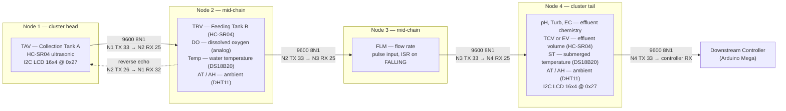

# CIRQUA

**Waterwise Futures — Technical Documentation**

This is the engineering documentation for the embedded monitoring platform built
around a chain of four ESP32 nodes. It is written for **field technicians** who
have to power, mount, identify and repair a node; **embedded engineers** who need
to reason about the FreeRTOS task layout, the UART link and the measurement
chain; **researchers** who need to know what the platform actually measures and
how the values are derived; and **project partners** who need a precise,
audited description of the hardware and firmware rather than a marketing
summary.

Every statement about hardware or firmware on these pages is taken from a named
file at a recorded firmware revision. Where a claim comes from the project's
own website rather than from source code, it is labelled as a *project fact*.
Where a page offers an opinion about maintenance practice, it is labelled as a
*recommendation*. Where something is unknown, it is marked
**Not verified from the current source.**

---

## Start here

  <a class="cirqua-card" href="architecture/system-architecture.html">
    Architecture
    <strong>System Architecture</strong>
    Layered view: sensing, RTOS, link, node head and tail.
  </a>
  <a class="cirqua-card" href="architecture/node-topology.html">
    Architecture
    <strong>Node Topology</strong>
    The UART chain, pin assignments and role of each node.
  </a>
  <a class="cirqua-card" href="sensors/index.html">
    Sensors
    <strong>Sensors</strong>
    Ultrasonic, DS18B20, DHT11, dissolved oxygen, flow, pH, turbidity, EC.
  </a>
  <a class="cirqua-card" href="firmware/index.html">
    Firmware
    <strong>Firmware</strong>
    Repository layout, build, flashing and the source map.
  </a>
  <a class="cirqua-card" href="calibration/index.html">
    Calibration
    <strong>Calibration</strong>
    Per-node constants, the Node 4 console and NVS storage.
  </a>
  <a class="cirqua-card" href="field-service/index.html">
    Field service
    <strong>Field Service</strong>
    Start-up checklist, node identification and troubleshooting.
  </a>
  <a class="cirqua-card" href="references/index.html">
    Evidence
    <strong>References</strong>
    Official project sources, datasheets and the source registry.
  </a>

---

## The verified node topology

This diagram is built from the `#define` pin maps and the inter-node UART
assignments in the firmware at revision `db6d9b8`. It shows what each node
actually measures — not what a node could measure.

!!! info "How the UART pairs are wired"
    Each node exposes two hardware UARTs, and the same two GPIO numbers recur
    on every node for different link directions. The upstream-facing link is
    **RX 25 / TX 26** and the downstream-facing link is **RX 32 / TX 33** on
    Nodes 2, 3 and 4. Node 1 is the exception: it has only one bidirectional
    UART, **RX 32 / TX 33**, because it both originates the frame and receives
    the echo. Always read the pair from the specific node page rather than
    assuming it — see [Serial links](communication/serial-links.md).

The chain is **unidirectional upstream** with a single **reverse echo** from
Node 2 to Node 1. Node 1 originates the frame and merges the returned values for
its own display. Node 4 terminates the chain and forwards a cleaned packet to
the downstream controller.

> **Important:** pin numbers do **not** carry across nodes. Node 1 uses GPIO 17
> for ultrasonic ECHO and Node 2 also uses GPIO 17 for its ECHO; GPIO 2 is Node 1
> TRIG but is Node 4 ECHO. Never wire two different physical nodes together by
> matching pin numbers. See <a href="architecture/node-topology.html">Node Topology</a>.

---

## Current system

| Node | MCU | Sensors implemented in source | Role in the chain |
|---|---|---|---|
| Node 1 | ESP32 | HC-SR04 ultrasonic (TAV) | Cluster head — originates the upstream frame; merges reverse telemetry for its LCD |
| Node 2 | ESP32 | HC-SR04 ultrasonic (TBV), analog dissolved oxygen (DO), DS18B20 water temperature (`Temp`), DHT11 ambient (`AT`, `AH`) | Mid-chain — appends its own fields, echoes a subset back to Node 1 |
| Node 3 | ESP32 | Flow pulse input (`FLM`) | Mid-chain — appends flow rate, substitutes a fallback frame on upstream timeout |
| Node 4 | ESP32 | Analog pH, turbidity, EC; HC-SR04 ultrasonic effluent volume (`TCV`); DS18B20 submerged temperature; DHT11 ambient | Cluster tail — strips `AT`/`AH` from upstream, adds effluent fields, drives LCD and forwards to the controller |
| Node 4 (SMTP variant) | ESP32 | As Node 4 | Cluster tail — different downstream field set; adds Wi-Fi, NTP and e-mail reporting |

All five sketches use the Arduino ESP32 framework and FreeRTOS with
dual-core pinning via `xTaskCreatePinnedToCore`. `setup()` creates the tasks and
`loop()` immediately calls `vTaskDelete(NULL)`; the Arduino loop task is not the
runtime.

---

## Documentation status

  

    Firmware repository
    <a href="https://github.com/lestealthy/Cirqua">github.com/lestealthy/Cirqua</a>
  

  

    Firmware branch
    <code>main</code>
  

  

    Firmware revision (commit)
    <code>db6d9b896341a9c7d8fd01913e854b663c110d55</code> (short <code>db6d9b8</code>)
  

  

    Active implementation
    current <code>FreeRTOS_Implementation/</code>
  

  

    Legacy implementation
    historical <code>_OLD/</code> — never the current architecture
  

  

    Documentation repository
    <a href="https://github.com/lestealthy/Cirqua-documentation">github.com/lestealthy/Cirqua-documentation</a>
  

  

    Live documentation site
    <a href="https://lestealthy.github.io/Cirqua-documentation/">lestealthy.github.io/Cirqua-documentation</a>
  

The firmware is identified by a **commit revision**, not a semantic version
number. No version scheme is defined in the repository.

> **Not verified from the current source.** The exact ESP32 board or devkit
> model, the power supply, and whether any node is physically deployed in the
> field are not recorded in the repository.

---

## Organisations and roles

CIRQUA is a Horizon Europe funded research project. The firmware and this
documentation are engineering work delivered by a third party. These are three
separate things and none of them owns another's marks.

| Organisation | What it is | What it owns here |
|---|---|---|
| **CIRQUA** ("Waterwise Futures") | The funded research project: *"Integrated Approaches at Local Scale for Enhancing Water Reuse Efficiency and Sustainable Soil Fertilization from Wastewater's Recovered Nutrients"* | Project-level claims, grant identity, project branding and project statements |
| **African Biotechnology Company (ABC)** | CIRQUA project partner, founded 2017, based in Tunis, Tunisia | Its own name, marks and service descriptions. Listed publicly as a CIRQUA project partner |
| **WattLab** | Documentation and firmware engineering | This documentation set and the contents of the firmware repository |

Claims about the project — budget, duration, consortium size, scope — belong to
the CIRQUA project and are reproduced here with attribution. They are collected
on the <a href="references/official-project-sources.html">Official Project
Sources</a> page, which cites `https://cirqua-water.eu/`. This documentation set
does not restate or extend the project's claims; it documents the hardware and
firmware only.

Project and partner marks are the property of their respective organisations.
Nothing here grants permission to reuse them.

---

## How to use this documentation

* **Identify a physical unit before anything else.** Nodes are externally
  indistinguishable in the repository because no enclosure artwork, schematic or
  hardware photograph exists. Use <a href="field-service/node-identification.html">Node
  Identification</a> and the behaviour differences in
  <a href="nodes/index.html">Nodes</a> to work out which node you are holding.
* **Reading a measurement page?** Start at
  <a href="sensors/index.html">Sensors</a> for the measurement model, then
  <a href="calibration/index.html">Calibration</a> for the constants that must be
  adjusted per installation. Never assume two nodes share constants — the tank
  geometry differs per node.
* **Debugging the link?** Read
  <a href="architecture/data-flow.html">Data Flow</a> for the frame formats,
  <a href="architecture/timing.html">Timing</a> for the poll and timeout
  behaviour, and <a href="communication/index.html">Communication</a> for the
  link itself.
* **Checking a claim?** Every code block on this site carries a provenance div
  naming the file, symbol and commit. If a page says "not verified", that is a
  deliberate gap, not an omission.

!!! warning "Field-service callout"
    Before opening an enclosure or swapping a sensor, work through
    <a href="field-service/startup-checklist.html">Startup Checklist</a> and
    <a href="field-service/sensor-replacement.html">Sensor Replacement</a>. The
    chain has **no checksum, no CRC, no sequence number, no acknowledgement and
    no retry** — a physically broken link produces plausible-looking but wrong
    numbers rather than an obvious error, unless the node health flags are
    inspected. See <a href="communication/fault-handling.html">Fault Handling</a>.

---

## Where to go next

* The project itself: <a href="project/index.html">Project</a> ·
  <a href="project/overview.html">Overview</a> ·
  <a href="project/objectives.html">Objectives</a> ·
  <a href="project/system-context.html">System Context</a> ·
  <a href="project/terminology.html">Terminology</a>
* The engineering detail: <a href="architecture/index.html">Architecture</a> ·
  <a href="rtos/index.html">RTOS</a> ·
  <a href="hardware/index.html">Hardware</a> ·
  <a href="firmware/code-reference.html">Code Reference</a> ·
  <a href="validation/known-limitations.html">Known Limitations</a>
