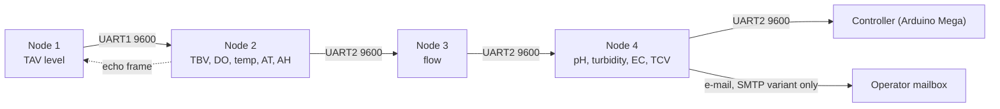

# Field Nodes

The CIRQUA monitoring cluster is four ESP32 boards chained together over UART.
Each node is a **field-service unit**: it is powered, mounted, identified by a QR
code and repaired on its own. This section is the entry point for a technician
standing in front of a box in the field.

Open the page for the node you are holding. Every node page carries the same
section order — Identity, Responsibilities, Inputs, Outputs, Controller, GPIO
Map, Power, Communication, RTOS Architecture, Firmware, Sensors, Calibration,
Display, Troubleshooting, Validation, Source — so you can find the same
information in the same place on every node.

## Node index

| Page | Node | Role in the chain | Local sensors | Display |
|---|---|---|---|---|
| [Node 1](node1.md) | Node 1 | **Cluster head** — originates the upstream frame | HC-SR04 (Collection Tank A, TAV) | 16×4 I²C LCD, status line |
| [Node 2](node2.md) | Node 2 | **Router** — consolidates Node 1 + own data, echoes its own values back | DS18B20, dissolved oxygen, HC-SR04 (TBV), DHT11 | None |
| [Node 3](node3.md) | Node 3 | **Flow injection** — forwards and adds flow | Flow sensor, pulse-counted | None |
| [Node 4](node4.md) | Node 4 | **Cluster tail** — analytics and quality sensors, forwards to the controller | pH, turbidity, EC, DS18B20, DHT11, HC-SR04 (TCV) | 16×4 I²C LCD |
| [Node 4 SMTP](node4-smtp.md) | Node 4 (SMTP variant) | **Cluster tail with e-mail reporting** — same sensors, different calibration defaults and frame fields | as Node 4 | 16×4 I²C LCD |

## How the chain fits together

Only Node 1 **originates** the telemetry frame. Every other node extends or
passes it on, so a chain break upstream of Node N means Node N sees no frame at
all. There is no local regeneration of the upstream fields anywhere in the
chain.

## Choosing the right page

* You are at the tank with the LCD that shows `C…L F…L` and a `STATUS:` line →
  [Node 1](node1.md).
* You are at the enclosure with a 1-Wire probe, an analogue dissolved-oxygen
  probe and an ultrasonic head over Feeding Tank B → [Node 2](node2.md).
* You are at the small board with a single flow sensor and no display →
  [Node 3](node3.md).
* You are at the water-quality enclosure (pH, turbidity, EC probes) →
  [Node 4](node4.md), **or** [Node 4 SMTP](node4-smtp.md) if the unit also
  has Wi-Fi and sends e-mail.

!!! warning "Node 4 has two firmware variants"
    `Node4` and `Node4_SMTP` use the same sensors and the same GPIO map, but they
    do **not** emit the same downstream fields, they do **not** use the same
    default calibration, and only `Node4` has the serial calibration console.
    Read the variant differences on the
    [Node 4 SMTP](node4-smtp.md) page before you swap or reconfigure a unit.

## Shared properties of every node

| Property | Value | Evidence |
|---|---|---|
| Controller | ESP32 | Firmware, all five sketches |
| Firmware framework | Arduino ESP32 `.ino` sketches | Firmware repository |
| Execution model | FreeRTOS, `xTaskCreatePinnedToCore`, `vTaskDelayUntil` | Firmware, all five sketches |
| Inter-node baud | `9600`, `SERIAL_8N1` | `INTERNODE_BAUD` in every sketch |
| Debug UART | `Serial.begin(115200)` | Every `setup()` |
| `loop()` | `vTaskDelete(NULL)` — the Arduino task is reclaimed | Every sketch |
| Frame format | `\|key:value` fields, `;` terminator, `\n` | Protocol, all nodes |
| Integrity | Structural key-presence validation only; **no checksum, CRC, sequence number, acknowledgement or retry** | Protocol |
| Board variant | > **Not verified from the current source.** | — |

## Related pages

* [Node Topology](../architecture/node-topology.md) — the chain seen from the
  architecture side.
* [GPIO Map](../hardware/gpio-map.md) — all four nodes side by side.
* [Serial Links](../communication/serial-links.md) — wiring and buffers.
* [Message Format](../communication/message-format.md) — every field, every
  producer.
* [RTOS Tasks](../rtos/tasks.md) — the full task table for the cluster.
* [Firmware Source Map](../firmware/source-map.md) — which file is which.
* [Node Identification](../field-service/node-identification.md) — QR codes and
  physical identification.