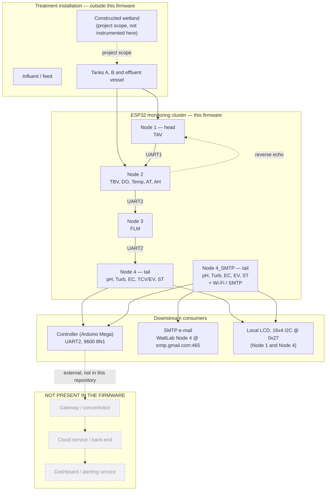

# System Context

## Scope of the firmware

The audited firmware at commit `db6d9b8` implements exactly one thing: a chain of
four ESP32 nodes that acquires measurements, merges them into an ASCII frame and
hands that frame to a downstream device over UART. It is a **sensing and
forwarding** system with a local human-readable display. It is not a networked
platform.

> **Not verified from the current source.** The repository contains **no gateway,
  no cloud client, no back-end service, no database and no HTTP server code**.
  The chain terminates at a downstream **Controller (Arduino Mega)**, and the
  `Node4_SMTP` variant can additionally send an e-mail via SMTP. Those are the
  only two exits from the cluster.

## Context diagram

The dashed nodes in the lower block are drawn to mark the boundary explicitly.
They are **not** implemented here and must not be assumed.

## What crosses the boundary

| Boundary | Direction | What crosses | Notes |
|---|---|---|---|
| Sensors → node firmware | in | Raw counts, pulses, digital levels | No actuator output in the audited source |
| Node → node | both | ASCII `key:value` frames, `|` separated, `;` terminated | 9600 baud, 8N1 |
| Node 1 → operator | out | 16×4 I2C LCD, address `0x27` | Local only |
| Node 4 → operator | out | 16×4 I2C LCD, address `0x27` | Local only |
| Node 4 → controller | out | Cleaned upstream frame + effluent fields | Pins annotated `// To Controller (Mega)` |
| Node 4_SMTP → network | out | HTML e-mail over SSL | **Configuration values in the committed source are placeholders and are not working credentials.** See <a href="../nodes/node4-smtp.html">Node 4 (SMTP)</a> |
| Debug | out | `Serial` at 115200 | Node 4 also hosts a calibration console on this port |

## Why the downstream controller matters

The cluster's design assumption is that **something downstream owns the data**.
Node 4 assembles the final packet, deliberately strips the upstream `AT` and `AH`
ambient tokens so the controller receives exactly one ambient pair — taken from
Node 4's own DHT11 — and then appends the effluent measurements. From the
firmware's point of view the controller is the system boundary; storage,
interpretation and reporting are somebody else's responsibility.

> **Engineering interpretation.** Because there is no checksum, sequence number,
> acknowledgement or retry anywhere in the chain, the controller must be treated
> as a passive sink. Loss or duplication of a frame is undetectable from the
> frame content alone. See <a href="../communication/fault-handling.html">Fault
  Handling</a>.

## Network position

The base `Node4` build has **no network interface at all**. Only the `Node4_SMTP`
variant includes `WiFi.h` and `ESP_Mail_Client.h`, and it is a *fire-and-forget*
reporting path: it sends a start-up e-mail on every boot and a 24-hour
heartbeat with a 12-hour error cooldown. It is not a bidirectional channel and
carries no configuration downlink.

> **Not verified from the current source.** Whether the downstream Arduino Mega
> controller forwards data to a gateway, cloud service or operator dashboard is
> outside this repository and is not documented here.

Next: <a href="terminology.html">Terminology</a> defines every field key that
crosses these boundaries.
