# Scheduling

## Priority hierarchy

**Firmware implementation.** Only three priority values are used across the whole
cluster:

| Priority | Role | Nodes |
|---|---|---|
| **3** | UART task | All four nodes, plus the SMTP variant's `N4_EmailUART` |
| **2** | Sensor task | All four nodes |
| **1** | LCD task | Node 1 and Node 4 only |

```
UART (3)  >  Sensors (2)  >  LCD (1)
```

**Engineering interpretation.** The hierarchy says the serial link matters more
than the measurement and the display matters least. That is the right ordering
for this system: a stale reading is not a fault, but a link that stops draining
its receive buffer **is** — it will overflow and drop frames. The LCD, by
contrast, only needs to be readable by a human walking past, and it re-renders
twice a second, so giving it the lowest priority costs almost nothing and
guarantees it can never delay telemetry.

Note the consequence: if an LCD task were ever to block, it would do so without
affecting either sensing or transport.

## Core affinity rationale

**Firmware implementation.** Every task is created with
`xTaskCreatePinnedToCore`. All UART tasks are pinned to **core 0**; all sensor
and LCD tasks are pinned to **core 1**.

**Engineering interpretation.** Three distinct reasons justify this split, in
descending order of importance:

1. **Isolation of blocking sensor operations.** Node 4's DS18B20 conversion
   blocks for roughly 187.5 ms. If that ran on the same core as the UART task,
   serial servicing would stall for that entire window on every 1 Hz cycle. On
   separate cores, the UART task continues uninterrupted while core 1 blocks.

2. **Serial latency determinism.** All serial work is confined to one core, so
   its scheduling behaviour is predictable: it is affected only by other
   core-0 work, of which there is none in the non-SMTP sketches. Confining
   transport to a single core makes its timing analysable.

3. **Separation from the radio stack.** On the ESP32 the Wi-Fi and Bluetooth
   stacks run on core 0. The `Node4_SMTP` variant enables Wi-Fi, so core 0 is
   already carrying radio work. Keeping the UART task there does not eliminate
   the contention, but confining sensing and display work to core 1 keeps the
   radio's interference out of the acquisition path — which matters because
   analogue measurements are the ones that would be perturbed.

**Engineering interpretation — the ADC2 caveat.** This reasoning has a limit
that is not a scheduling issue but is worth stating here: confining tasks to
cores does **not** resolve the fact that Node 4's pH, turbidity and EC inputs
are on ADC2, which is unusable while Wi-Fi is active. Core pinning and ADC2
exclusion are unrelated mechanisms. See <a href="../hardware/controllers.html">Controllers</a>.

## Periodicity and drift

**Firmware implementation.** The periodic tasks use `vTaskDelayUntil` rather
than `vTaskDelay`.

**Engineering interpretation.** This is the correct choice and the reason is
worth recording, because the two are easy to confuse:

* `vTaskDelay(ms)` sleeps for `ms` **from the moment the task finishes**. Any
  execution time is therefore added to the interval, and the period slowly
  lengthens — the task accumulates drift proportional to its own runtime.
* `vTaskDelayUntil(&lastWake, period)` sleeps until an **absolute** wake time
  computed from the previous one. Execution time is absorbed into the next
  sleep, so the period stays fixed.

For a telemetry node whose output feeds a 1 Hz log, drift is unacceptable: over a
day at 2 Hz, even a few milliseconds of per-cycle overrun becomes a visible
offset. `vTaskDelayUntil` keeps the published values aligned to the wall clock.

## Timing table

**Firmware implementation**, from the task table and the constants in the
source:

| Node | Task | Period | Mechanism | Blocking time inside the cycle |
|---|---|---|---|---|
| 1 | `N1_Sensors` | 500 ms | `vTaskDelayUntil` | Echo wait up to 30000 µs (30 ms) |
| 1 | `N1_UART` | 1 ms loop | Poll | None; `TX_INTERVAL_MS` is 500 ms |
| 1 | `N1_LCD` | 500 ms | `vTaskDelayUntil` | I2C writes |
| 2 | `N2_Sensors` | 1000 ms | `vTaskDelayUntil` | Echo wait up to 20000 µs (20 ms) |
| 2 | `N2_UART` | 50 ms | `vTaskDelayUntil` | Serial write only |
| 3 | `N3_Flow` | 1000 ms | `vTaskDelayUntil` | None — reads an accumulated count |
| 3 | `N3_UART` | 50 ms | `vTaskDelayUntil` | Serial write only |
| 4 | `N4_Sensors` | 1000 ms | `vTaskDelayUntil` | Echo up to 25000 µs (25 ms) **plus DS18B20 ~187.5 ms** |
| 4 | `N4_UART` | 50 ms | `vTaskDelayUntil` | Serial write; also services the 115200 baud console |
| 4 | `N4_LCD` | 500 ms | `vTaskDelayUntil` | I2C writes |
| 4 SMTP | `N4_EmailUART` | 50 ms | `vTaskDelayUntil` | Serial write **plus Wi-Fi/TLS activity** |

### Derived rates

| Quantity | Value | Basis |
|---|---|---|
| Link servicing rate on Nodes 2, 3, 4 | **20 Hz** | 50 ms poll interval |
| Link servicing rate on Node 1 | **1000 Hz** | 1 ms loop |
| Frame origination rate (Node 1) | **2 Hz** | `TX_INTERVAL_MS` is 500 ms |
| Acquisition rate (Nodes 2, 3, 4) | **1 Hz** | 1000 ms period |
| Acquisition rate (Node 1) | **2 Hz** | 500 ms period |
| Display refresh (Nodes 1, 4) | **2 Hz** | 500 ms period |
| DHT11 read rate (Nodes 2, 4) | **0.5 Hz maximum** | Paced by `xLastDHTTick` at 2000 ms |
| DS18B20 conversion (Node 4) | ~5.3 Hz equivalent capacity | 187.5 ms conversion inside a 1 Hz task |

**Engineering interpretation.** The DHT11 pacing is a sensor limit, not a
firmware one. The DHT11 part itself cannot be read faster than about every
2 seconds reliably, and the firmware enforces that interval with
`xLastDHTTick`. The practical effect is that Node 2's and Node 4's ambient
values are, at best, half the age of the tank measurements in the same frame —
worth knowing when interpreting a reading taken right after a change.

## The blocking DS18B20 conversion on Node 4

**Firmware implementation.** Node 4's sensor task calls
`setResolution(10)` (0.25 °C) and `setWaitForConversion(true)`, which makes
`getTempCByIndex()` **block** until the conversion completes. The source comment
records the cost as approximately **187.5 ms** at 10-bit resolution, and accepts
it inside the 1 Hz task.

**Engineering interpretation.** 187.5 ms out of a 1000 ms period is roughly 19 %
of core 1 occupied in a blocking wait, plus the 25 ms ultrasonic timeout. The
task is therefore idle for the remaining ~75 % of each cycle. This is a
deliberate design choice, recorded in the source as acceptable, rather than an
oversight — the alternative, a non-blocking read like Node 2 uses, would return
the *previous* conversion's result and add one period of lag to every
submerged-temperature reading.

Node 2's DS18B20 uses the opposite strategy — `setWaitForConversion(false)` with
`requestTemperatures()` each cycle — because Node 2 also performs DO
compensation that consumes the water temperature, and a one-cycle lag there
would feed the compensation factor a stale value.

**Recommendation.** If the Node 4 sensor task ever needs a faster period, the
DS18B20 blocking call is the first thing to revisit; it is the only long
blocking operation in the acquisition path.

## Node 1's 1 ms UART loop

**Firmware implementation.** Node 1's UART task loops with a 1 ms cadence
rather than 50 ms.

**Engineering interpretation.** Node 1 is the head of the chain and receives the
reverse echo from Node 2 as well as transmitting the upstream frame. A 1 ms poll
means the receive buffer is drained 1000 times a second, so:

* The chance of a buffer overrun on the Node 1 → Node 2 direction is far lower
  than on the 50 ms nodes.
* The reverse echo is parsed with much lower latency, which matters because the
  echo drives the Node 1 display.
* The cost is 1000 task wake-ups per second at priority 3 on core 0 — about
  2000 wake-ups per second across the whole node pair including Node 2's 20 Hz.

At 9600 baud the wire carries roughly 960 bytes per second, so a 1 ms poll is
comfortably faster than the link can deliver. This is generous rather than
necessary — **engineering interpretation:** a 5 ms poll would be ample for link
reliability. But nothing in the timing budget is endangered by it, since the
task does almost nothing per iteration when there are no bytes.

## What happens when a task overruns

**Engineering interpretation.** The firmware uses `vTaskDelayUntil`
everywhere, so an overrun is **absorbed** rather than compounded: a task that
takes 1200 ms for a 1000 ms period simply wakes 200 ms late and the next cycle
is scheduled from the fixed wake time. It does not drift further into the
following cycle.

But there are real consequences:

| Overrun source | Effect |
|---|---|
| Ultrasonic echo timing out (30 ms / 20 ms / 25 ms) | Adds the full timeout to that cycle. The sample is still committed, with whatever partial result. Node 4 marks an out-of-range distance invalid. |
| Node 4 DS18B20 at 187.5 ms | Always present. Budgeted for. |
| Wi-Fi/TLS on the SMTP variant | **The most likely source of a long overrun.** TLS handshakes and SMTP transactions can block for hundreds of milliseconds. |
| Mutex contention | Bounded by the 50 / 20 / 10 ms timeouts; on timeout the task proceeds with a zeroed snapshot. |
| Serial transmit at 9600 baud | A 100-byte frame takes roughly 10 ms. Long frames approach the frame buffer limit. |

Two things are worth stating explicitly:

1. **A late task does not delay another node.** Nodes are independent
   controllers. Node 2 running slow does not slow Node 1; it delays the frame by
   one Node 2 period at most.
2. **A late task can lose data.** There is no queue and no store-and-forward. If
   `N2_UART` is blocked long enough that Node 1's next frame arrives and
   overwrites the reassembly buffer, that frame is dropped. Nothing replays it.
   See <a href="../communication/fault-handling.html">Fault Handling</a>.

**Engineering interpretation.** The SMTP variant is the one place where a long
unbounded blocking operation shares a task with serial forwarding. Its
`Task_Email_And_UART_Node4` runs at 50 ms on core 0 and must service the
console, forward telemetry, and potentially perform a TLS transaction. This is
the single most fragile timing arrangement in the cluster, and it is worth
watching on the bench before field deployment.

## Timing summary

```mermaid
gantt
  title Node 4 sensor task — one 1000 ms cycle (core 1)
  dateFormat X
  axisFormat %s

  section N4_Sensors
  DS18B20 blocking conversion (≈187.5 ms) :0, 188
  HC-SR04 echo wait (up to 25 ms)         :188, 213
  pH / turbidity / EC filtered ADC reads  :213, 260
  DHT11 (paced to 2000 ms minimum)        :260, 280
  Snapshot commit under mutex (≤50 ms)    :280, 330
  Idle until next wake                    :330, 1000
```



The diagram is **engineering interpretation** drawn to scale from the constants
in the source; the relative order of operations within the cycle is not asserted
by the firmware, only the durations are.

## Related pages

* <a href="tasks.html">RTOS Tasks</a> — stacks, priorities and periods.
* <a href="synchronisation.html">Synchronisation</a> — mutex contention as a
  delay source.
* <a href="../architecture/timing.html">Timing</a> — end-to-end latency across
  the chain.
* <a href="../nodes/node4-smtp.html">Node 4 (SMTP)</a> — the variant with the
  most demanding timing.
