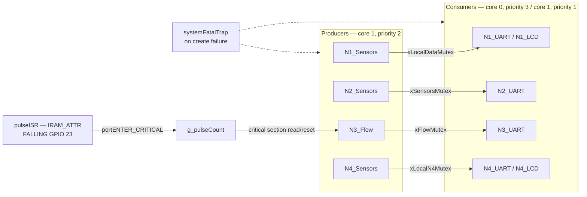

---

title: Synchronisation

description: Mutex inventory for the CIRQUA nodes, lock timeouts of 50, 20 and 10 ms, and the portMUX_TYPE critical section protecting Node 3's pulse counter.

---

# Synchronisation

Two synchronisation mechanisms are used across the cluster, and they are used for

different things:

| Mechanism | Used for | Where |

|---|---|---|

| **Mutex** (`xSemaphoreCreateMutex`) | Protecting shared global structs between tasks | All four nodes |

| **Critical section** (`portMUX_TYPE` spinlock) | Protecting a single 32-bit counter against ISR interference | Node 3 only |

No FreeRTOS queues, task notifications, semaphores-as-notifications or event

groups are used. See <a href="queues.html">Queues and Buffers</a>.

## Mutex inventory

Every mutex is created with `xSemaphoreCreateMutex()`. **Failure to create any

mutex halts the node** via `systemFatalTrap()`.

### Node 1

| Mutex | Protects | Written by | Read by |

|---|---|---|---|

| `xLocalDataMutex` | `g_localSensors` — Node 1's own TAV volume and validity | `N1_Sensors` | `N1_UART`, `N1_LCD` |

| `xNode2DataMutex` | `g_node2Data` — DO, water temp, TBV, ambient temp/humidity and the `node2` health flag, parsed from the reverse echo | `N1_UART` | `N1_LCD` |

Node 1 is the only node with **two** mutexes, because it is the only node that

both produces a local measurement and parses a remote one into two separate

structs.

### Node 2

| Mutex | Protects | Written by | Read by |

|---|---|---|---|

| `xSensorsMutex` | `g_n2Sensors` — DS18B20 water temp, DO, TBV, DHT11 ambient and their validity flags | `N2_Sensors` | `N2_UART` |

| `xN1DataMutex` | `g_n1Data` — TAV and the `node1` health flag, parsed from the upstream frame | `N2_UART` | `N2_UART` |

| `xN3DataMutex` | `g_n3Data` — flow rate and the `node3` health flag, parsed from the reverse telemetry | `N2_UART` | `N2_UART` |

`xN1DataMutex` and `xN3DataMutex` are **written and read by the same task**.

They exist to bridge the gap between the parse step and the transmit step across

a lock acquisition — each link's parsed result has to survive long enough for the

snapshot that builds the outgoing frame.

### Node 3

| Mutex | Protects | Written by | Read by |

|---|---|---|---|

| `xFlowMutex` | `g_flowData` — the 1 Hz flow rate in L/min and its validity | `N3_Flow` | `N3_UART` |

Node 3 has the smallest mutex footprint in the cluster: one producer, one

consumer, one struct.

### Node 4 and Node 4 SMTP

| Mutex | Protects | Written by | Read by |

|---|---|---|---|

| `xLocalN4Mutex` | `g_localN4` — effluent volume, pH, turbidity, EC, submerged temperature, ambient temperature/humidity and all validity flags | `N4_Sensors` | `N4_UART`, `N4_LCD` |

One mutex covers the whole of Node 4's local state. **Engineering

interpretation:** that is acceptable only because there is a single producer and

consumers that take a whole-struct snapshot. Two separate Node 4 tasks reading

*different fields* concurrently under one mutex would serialise against each

other unnecessarily.

## Lock timeouts

Every `xSemaphoreTake` is bounded. The values are consistent across the

firmware:

| Timeout | Used for | Where |

|---|---|---|

| **50 ms** | Sensor task committing a completed sample | All four nodes |

| **20 ms** | UART task taking a snapshot to format a frame | Nodes 2, 3, 4 |

| **10 ms** | Node 1's transmit-path snapshot | Node 1 |

The pattern is clear: **longer for the producer, shorter for the consumer.** The

sensor task holds its mutex for a long time relative to a 50 Hz poll, so it is

given room; the consumers are given much less because they cannot afford to

block the chain.

**Engineering interpretation.** The 10 ms value on Node 1 is roughly the time

needed to transmit a maximum-length frame at 9600 baud — a 512-byte frame would

take about 530 ms, but a realistic 100-byte frame takes about 10 ms. The

timeouts are therefore tuned to be *just* long enough for the operation that

usually precedes them, which is the right instinct: fail fast rather than

propagate delay.

### Consequence of a timed-out take — stated honestly

**Firmware implementation.** The take is bounded and the code **proceeds on

timeout**. It does not abort, retry, or raise a flag.

**Engineering interpretation.** A timed-out take means the task formats its

frame from a **zero-initialised local snapshot**. The frame therefore goes out on

the wire carrying zeros — for example `|TAV:0.00|node1:0|DO:0.00|Temp:0.00|...`

— and the downstream nodes cannot tell this apart from genuine zeros.

The health flags make this partially self-correcting in one direction: a

zero-initialised snapshot also carries health flags of `0`, so a downstream node

will mark the upstream as unhealthy. But the *measurement fields themselves*

carry no such marker, and a genuine reading of `0.00` with a healthy flag is

indistinguishable from a failed snapshot that happened to be formatted with a

healthy flag by a node that does not gate on snapshot success.

**Recommendation.** If this ambiguity matters for a downstream consumer, the

protocol would need an explicit validity marker per field, or a sequence number

that could reveal a repeated or skipped frame. Neither exists today — see

<a href="../communication/message-format.html">Message Format</a>.

## Why mutexes rather than critical sections for the structs

**Engineering interpretation.** The shared structs are only ever touched from

**task context**, never from an ISR. That makes a mutex the natural choice: it

blocks the caller rather than spinning, it can carry a priority inheritance

mechanism, and it can be taken with a bounded timeout — none of which is true of

a bare critical section.

**On priority inheritance.** The FreeRTOS mutexes created here via

`xSemaphoreCreateMutex()` inherit the standard FreeRTOS mutex semantics, which

*do* include priority inheritance. The cluster does not need it in practice:

* Task priorities are only 1, 2 and 3, so the priority-inversion window is at

  most two priority levels deep.

* Every critical section is a struct copy — microseconds of work, not

  milliseconds.

* A timeout bounds the worst case regardless.

So priority inheritance is available but not load-bearing. This is worth stating

because the absence of a `xSemaphoreCreateRecursiveMutex` or an explicit priority

ceiling is not an oversight — it is simply unnecessary at these priorities and

these critical-section lengths.

## The critical section on Node 3

Node 3's flow pulse input is the only place where a variable is shared between

an **interrupt** and a **task**.

```cpp

--8<-- "assets/snippets/node3-pulse-isr.cpp"

```

<div class="cirqua-source">

<span class="cirqua-source__label">Source</span>

<a href="https://github.com/lestealthy/Cirqua/blob/db6d9b896341a9c7d8fd01913e854b663c110d55/FreeRTOS_Implementation/Node3/Node3.ino">lestealthy/Cirqua</a> ·

<code>FreeRTOS_Implementation/Node3/Node3.ino</code> ·

<code>pulseISR</code> and the <code>portMUX_TYPE</code> declaration ·

lines 15–23 · commit <code>db6d9b8</code>
</div>

| Property | Detail |

|---|---|

| Shared variable | `g_pulseCount`, `volatile uint32_t` |

| Writer | `pulseISR()`, `IRAM_ATTR`, triggered **FALLING** on GPIO 23 |

| Trigger source | Flow sensor configured with `INPUT_PULLUP`, so the idle state is high and each pulse pulls the line low |

| Reader | `N3_Flow`, once per 1000 ms; reads the count then resets it |

| Protection | `portMUX_TYPE` spinlock via `portENTER_CRITICAL` / `portEXIT_CRITICAL` |

### Why `volatile` alone is not enough

**Engineering interpretation.** `volatile` tells the compiler to re-read the

variable rather than cache it in a register. It does **not** make the

read-modify-write sequence atomic. `g_pulseCount++` compiles to a load, an

add, and a store; if a pulse arrives between the load and the store, the

increment is lost. On a 32-bit ESP32 a 32-bit load or store is itself atomic,

but the compound operation is not.

The critical section closes that window by preventing preemption and interrupt

entry across the increment.

### Why a spinlock and not a mutex

**Engineering interpretation.** A FreeRTOS mutex cannot be taken from an ISR —

calling `xSemaphoreTake` from interrupt context would be undefined behaviour.

`portENTER_CRITICAL` / `portEXIT_CRITICAL` is the ESP32's ISR-safe equivalent:

it disables interrupts on the current core for the duration of a very short

section. The critical section here wraps a single increment, so the interrupt

latency added is negligible.

The trade-off is that a spinlock **must** be held only for a bounded, very short

period. Incrementing a counter satisfies that; a `String` allocation or a serial

write would not.

**Engineering interpretation — a real limitation.** The flow counter is read and

reset in a **non-atomic** manner with respect to the ISR: `N3_Flow` reads

`g_pulseCount` and then writes zero to it, and a pulse arriving between the read

and the reset is lost. **Engineering interpretation:** this is inherent to a

"read then reset" scheme and the window is only a few microseconds wide, so the

expected loss is a small fractional error in a flow rate that is itself derived

from a nominal calibration factor. It is worth recording, not worth alarming

anyone about. A read-and-subtract (`count -= taken`) would close the window, but

that is a firmware change.

There is also **no overflow detection** on `g_pulseCount`. It is a free-running

`uint32_t` and nothing checks it.

## Where each primitive appears in the task diagram



## Summary

| Primitive | Count in cluster | Timeout | Fail behaviour |

|---|---|---|---|

| Mutex, sensor commit | 1 per node (4 total) | 50 ms | Proceeds with zeroed snapshot |

| Mutex, UART snapshot | 1 per multi-node node | 20 ms | Proceeds with zeroed snapshot |

| Mutex, Node 1 transmit snapshot | 1 | 10 ms | Proceeds with zeroed snapshot |

| Mutex, Node 2 link structs | 2 | 20 ms | Proceeds with zeroed snapshot |

| `portMUX_TYPE` critical section | 1 (Node 3 only) | none — non-blocking | Not applicable |

| Mutex creation failure | all | — | `systemFatalTrap()` halts the node |

**Total mutexes in the cluster: nine** — two on Node 1, three on Node 2, one on

Node 3, one on Node 4, and one on the Node 4 SMTP variant (the SMTP variant uses

the same `xLocalN4Mutex`, so it is the same mutex, not an additional one).

## Related pages

* <a href="queues.html">Queues and Buffers</a> — the structs and the

  snapshot pattern.

* <a href="tasks.html">RTOS Tasks</a> — task-to-mutex ownership.

* <a href="scheduling.html">Scheduling</a> — how contention actually arises.

* <a href="../communication/fault-handling.html">Fault Handling</a> — what a

  dropped or zeroed frame looks like downstream.

