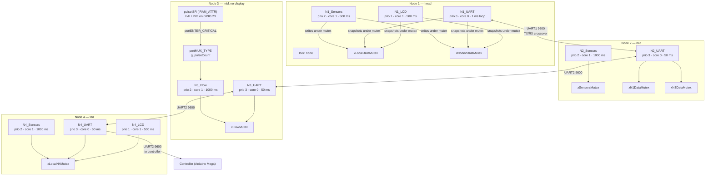

---

title: RTOS Tasks

description: Authoritative FreeRTOS task table for the CIRQUA nodes — task names, functions, stack sizes, priorities, core pinning and periods, with per-task breakdown.

---

# RTOS Tasks

**Authoritative table.** Every row below is transcribed verbatim from the

`xTaskCreatePinnedToCore` calls in the firmware at commit `db6d9b8`. Stack

figures are the values passed to the API, which on the Arduino ESP32 core are

specified in **words**, not bytes.

## Task table

| Node | Task name | Function | Stack | Priority | Core | Period |

|---|---|---|---|---|---|---|

| 1 | `N1_Sensors` | `Task_Sensors_Node1` | 3072 | 2 | 1 | 500 ms |

| 1 | `N1_UART` | `Task_UART_Node1` | 3072 | 3 | 0 | 1 ms loop |

| 1 | `N1_LCD` | `Task_LCD_Node1` | 3072 | 1 | 1 | 500 ms |

| 2 | `N2_Sensors` | `Task_Sensors_Node2` | 4096 | 2 | 1 | 1000 ms |

| 2 | `N2_UART` | `Task_UART_Node2` | 4096 | 3 | 0 | 50 ms |

| 3 | `N3_Flow` | `Task_Flow_Node3` | 3072 | 2 | 1 | 1000 ms |

| 3 | `N3_UART` | `Task_UART_Node3` | 3072 | 3 | 0 | 50 ms |

| 4 | `N4_Sensors` | `Task_Sensors_Node4` | 4096 | 2 | 1 | 1000 ms |

| 4 | `N4_UART` | `Task_UART_Node4` | 4096 | 3 | 0 | 50 ms |

| 4 | `N4_LCD` | `Task_LCD_Node4` | 3072 | 1 | 1 | 500 ms |

| 4 SMTP | `N4_Sensors` | `Task_Sensors_Node4` | 4096 | 2 | 1 | 1000 ms |

| 4 SMTP | `N4_EmailUART` | `Task_Email_And_UART_Node4` | **5120** | 3 | 0 | 50 ms |

| 4 SMTP | `N4_LCD` | `Task_LCD_Node4` | 3072 | 1 | 1 | 500 ms |

Observations that follow directly from the table, with no interpretation

required:

* **Node 1 is the only node with a 1 ms UART loop.** Every other UART task

  polls on a 50 ms cadence.

* **Node 1 is the only node whose sensor task runs at 2 Hz** rather than 1 Hz.

* **Node 3 has no display task** and no I2C bus.

* **The SMTP variant allocates 5120 words to its combined UART/e-mail task**,

  1024 words more than the plain Node 4 UART task — consistent with carrying an

  SSL/TLS and mail-client context in that task.

* The task counts are **three, two, two and three** respectively.

## Task relationship diagram



The cross-node arrows are the physical serial links, not shared memory. Each

node's tasks are entirely independent of every other node's — the only coupling

between nodes is the wire.

## Node 1 tasks

### `N1_Sensors` — `Task_Sensors_Node1`

* Stack 3072, priority 2, **core 1**, period **500 ms**.

* Triggers the HC-SR04 (TRIG GPIO 2, ECHO GPIO 17) with a 2–3 µs low / 10 µs

  high pulse and measures the echo with a **30000 µs** timeout.

* Converts distance to litres using the cylinder formula

  `π r² h / 1000` with `3.14159f`, `TANK_HEIGHT 260.0` cm,

  `TANK_RADIUS 110.0` cm, and a speed constant of `0.0343f` cm/µs divided by

  two for the round trip.

* **Applies a hard-coded doubling:** `volumeLiters = (int)(volumeLiters * 2.0f)`.

  This is an empirical compensation factor, not geometry, and it must be

  calibrated. See <a href="../calibration/ultrasonic.html">Ultrasonic

  Calibration</a>.

* Clamps the height to `[0, TANK_HEIGHT]`.

* Commits the result into `g_localSensors` under `xLocalDataMutex` with a

  **50 ms** lock timeout.

### `N1_UART` — `Task_UART_Node1`

* Stack 3072, priority 3, **core 0**, **1 ms loop**.

* Reads UART1 (RX GPIO 32 / TX GPIO 33) from Node 2 and reassembles frames into

  a `String` capped at **256** characters, resetting the index at **250**.

* Extracts `DO`, `Temp`, `TBV`, `AT`, `AH` and the `node2` health flag, and

  stores them into `g_node2Data` under `xNode2DataMutex`.

* Builds and transmits the upstream frame `|TAV:%d|node1:%d;\n` on a

  **500 ms** transmit interval, using a **10 ms** snapshot lock.

* Node 1 is the **only** node that originates the upstream frame.

### `N1_LCD` — `Task_LCD_Node1`

* Stack 3072, priority 1, **core 1**, period **500 ms**.

* Renders the four lines of the 16×4 display at address `0x27`:

  `C{TAV}L F{TBV}L`, `DO{mg/l} T{Temp}C`, `AT{AT}C H{AH}%`,

  `STATUS: {status}`.

* Derives the status string with a strict ten-step precedence — `WAITING`,

  `ERROR`, `HOT+HUM`, `OVERTEMP`, `HI HUMID`, `LOW C+F`, `LOW TAV`, `LOW TBV`,

  `FAULT`, `NORMAL`. Link health outranks thermal and volume conditions.

* Replaces the decimal point with a comma in the value lines.

```cpp

--8<-- "assets/snippets/node1-lcd-task.cpp"

```

<div class="cirqua-source">

<span class="cirqua-source__label">Source</span>

<a href="https://github.com/lestealthy/Cirqua/blob/db6d9b896341a9c7d8fd01913e854b663c110d55/FreeRTOS_Implementation/Node1/Node1.ino">lestealthy/Cirqua</a> ·

<code>FreeRTOS_Implementation/Node1/Node1.ino</code> ·

<code>Task_LCD_Node1</code> ·

lines 220–310 · commit <code>db6d9b8</code>
</div>

## Node 2 tasks

### `N2_Sensors` — `Task_Sensors_Node2`

* Stack 4096, priority 2, **core 1**, period **1000 ms**.

* Samples, in order: **DS18B20** water temperature on GPIO 4 with

  `setWaitForConversion(false)` and `requestTemperatures()` — non-blocking;

  **dissolved oxygen** on GPIO 34 (`ADC1_CH6`, 12-bit, `VREF 5000.0f`);

  **HC-SR04** on GPIO 16/17 with a **20000 µs** timeout; **DHT11** on GPIO 27,

  paced to at most one read every **2000 ms**.

* DO conversion: `doVoltage = (raw / 4095.0) * 5000.0`,

  `compFactor = 1.0 + (T - 25.0) * (-0.02)` using water temperature else 25.0,

  `DO = (doVoltage / 1000.0) * 8.26 * compFactor`, clamped at zero. Output

  unit is **mg/L**.

* Node 2 clamps the ultrasonic height to `[0, TANK_HEIGHT]`, where

  `TANK_HEIGHT 178.0` cm and `TANK_RADIUS 59.5` cm.

* Commits into `g_n2Sensors` under `xSensorsMutex` with a **50 ms** timeout.

```cpp

--8<-- "assets/snippets/node2-sensor-task.cpp"

```

<div class="cirqua-source">

<span class="cirqua-source__label">Source</span>

<a href="https://github.com/lestealthy/Cirqua/blob/db6d9b896341a9c7d8fd01913e854b663c110d55/FreeRTOS_Implementation/Node2/Node2.ino">lestealthy/Cirqua</a> ·

<code>FreeRTOS_Implementation/Node2/Node2.ino</code> ·

<code>Task_Sensors_Node2</code> ·

lines 98–220 · commit <code>db6d9b8</code>
</div>

### `N2_UART` — `Task_UART_Node2`

* Stack 4096, priority 3, **core 0**, period **50 ms**.

* Node 2 is the **most demanding** router in the cluster: it sits between Node 1

  and Node 3 and must both forward downstream and answer Node 1's reverse echo.

* Reads UART1 (RX 25 / TX 26, from Node 1) and parses the upstream frame into

  `g_n1Data` under `xN1DataMutex`.

* Reads UART2 (RX 32 / TX 33, from Node 3) and parses the reverse telemetry

  frame into `g_n3Data` under `xN3DataMutex`.

* Emits **three distinct frames** per cycle: the consolidated downstream frame

  to Node 3, the reverse echo to Node 1, and its own local-only echo shape.

* Each link has its own `char[128]` reassembly buffer.

* Snapshots both `g_n2Sensors` and the link structs under mutexes with a

  **20 ms** lock timeout.

```cpp

--8<-- "assets/snippets/node2-uart-routing.cpp"

```

<div class="cirqua-source">

<span class="cirqua-source__label">Source</span>

<a href="https://github.com/lestealthy/Cirqua/blob/db6d9b896341a9c7d8fd01913e854b663c110d55/FreeRTOS_Implementation/Node2/Node2.ino">lestealthy/Cirqua</a> ·

<code>FreeRTOS_Implementation/Node2/Node2.ino</code> ·

<code>Task_UART_Node2</code> ·

lines 259–370 · commit <code>db6d9b8</code>
</div>

**Node 2 has no LCD task.** Its values reach a human only through the Node 1

display, via the reverse echo frame.

## Node 3 tasks

### `N3_Flow` — `Task_Flow_Node3`

* Stack 3072, priority 2, **core 1**, period **1000 ms**.

* Reads the 32-bit `volatile uint32_t g_pulseCount` — accumulated by

  `pulseISR()` on **FALLING** edges at GPIO 23 — then **resets** the count and

  computes `flowRate = pulses / FLOW_CAL_FACTOR` where

  `FLOW_CAL_FACTOR 5.5f` pulses per litre. **Output unit: L/min.**

* Commits into `g_flowData` under `xFlowMutex`.

* **There is no pulse-count overflow detection.** The counter is free-running;

  a `uint32_t` at `5.5` pulses/litre would take on the order of 2.4 million

  years to wrap, so in practice this is benign, but the absence of a check is

  worth recording.

### `N3_UART` — `Task_UART_Node3`

* Stack 3072, priority 3, **core 0**, period **50 ms**.

* Reads the upstream frame from Node 2 (UART1, RX 25 / TX 26) into a

  `char[256]` reassembly buffer.

* Runs `validateUpstreamFrame()` on the reassembled frame, which is a

  **structural** check: the presence of the `TAV`, `node1`, `DO` and `node2`

  keys.

* Appends `|FLM:%.2f|node3:%d;\n` to the upstream frame and forwards it on

  UART2 (TX 33) to Node 4.

* Tracks upstream silence against `TIMEOUT_MS 2000` and emits a **one-shot**

  fallback frame — `|TAV:0.00|node1:0|DO:0.00|node2:0|FLM:%.2f|node3:%d;\n` —

  guarded by `timeoutAlertSent`, then mutes further alerts until the link

  recovers.

* On buffer overflow, **resets the index and drops the frame.**

```cpp

--8<-- "assets/snippets/node3-uart-forwarding.cpp"

```

<div class="cirqua-source">

<span class="cirqua-source__label">Source</span>

<a href="https://github.com/lestealthy/Cirqua/blob/db6d9b896341a9c7d8fd01913e854b663c110d55/FreeRTOS_Implementation/Node3/Node3.ino">lestealthy/Cirqua</a> ·

<code>FreeRTOS_Implementation/Node3/Node3.ino</code> ·

<code>Task_UART_Node3</code> ·

lines 82–154 · commit <code>db6d9b8</code>
</div>

**Node 3 has no display task** and does not originate the upstream frame — it is

a forwarder. The fallback frame above is the only frame it constructs from

nothing.

## Node 4 tasks

### `N4_Sensors` — `Task_Sensors_Node4`

* Stack 4096, priority 2, **core 1**, period **1000 ms**.

* The largest sensor task in the cluster. It acquires six channels:

  HC-SR04 on GPIO 4/2 (timeout **25000 µs**), pH on GPIO 13, turbidity on

  GPIO 14, EC on GPIO 12, the submerged DS18B20 on GPIO 27, and the DHT11 on

  GPIO 5.

* **Blocks** on the DS18B20 conversion: `setResolution(10)` with

  `setWaitForConversion(true)`. The source comment records the cost as roughly

  **187.5 ms** at 10-bit resolution and accepts it inside a 1 Hz task.

* Warns at boot if `getDeviceCount() == 0`.

* Applies range rejection on the ultrasonic channel — a distance `< 0` or

  `> TANK_HEIGHT + 20` is marked invalid. `TANK_HEIGHT 178.0` cm.

* Gates pH, turbidity and EC on `0.0 <= V <= 3.30`, and additionally gates the

  DHT11 ambient to −20…80 °C and 0…100 %.

* Commits into `g_localN4` under `xLocalN4Mutex` with a **50 ms** timeout.

```cpp

--8<-- "assets/snippets/node4-sensor-task.cpp"

```

<div class="cirqua-source">

<span class="cirqua-source__label">Source</span>

<a href="https://github.com/lestealthy/Cirqua/blob/db6d9b896341a9c7d8fd01913e854b663c110d55/FreeRTOS_Implementation/Node4/Node4.ino">lestealthy/Cirqua</a> ·

<code>FreeRTOS_Implementation/Node4/Node4.ino</code> ·

<code>Task_Sensors_Node4</code> ·

lines 374–712 · commit <code>db6d9b8</code>
</div>

### `N4_UART` — `Task_UART_Node4`

* Stack 4096, priority 3, **core 0**, period **50 ms**.

* Reads the upstream frame from Node 3 (UART1, RX 25 / TX 26) into a

  `char[384]` reassembly buffer, and assembles the downstream packet in a

  separate `char[512]` buffer.

* Runs `cleanUpstreamPacket()` to strip the `AT:` and `AH:` tokens so only

  Node 4's own ambient pair reaches the controller.

* Appends `|pH:%.1f|Turb:%d|EC:%.0f|TCV:%d|node4:1;\n` and transmits on UART2

  (TX 33) to the controller (RX 32).

* Also services the **calibration console** on the debug `Serial` port at

  115200 baud — `HELP`, `STATUS`, `SET:EC_K=`, `SET:PH_S=`, `SET:PH_O=`,

  `RESET` — which writes to the `node4_cal` NVS namespace.

* Snapshots `g_localN4` under `xLocalN4Mutex` with a **20 ms** lock timeout.

```cpp

--8<-- "assets/snippets/node4-uart-task.cpp"

```

<div class="cirqua-source">

<span class="cirqua-source__label">Source</span>

<a href="https://github.com/lestealthy/Cirqua/blob/db6d9b896341a9c7d8fd01913e854b663c110d55/FreeRTOS_Implementation/Node4/Node4.ino">lestealthy/Cirqua</a> ·

<code>FreeRTOS_Implementation/Node4/Node4.ino</code> ·

<code>Task_UART_Node4</code> ·

lines 996–1181 · commit <code>db6d9b8</code>
</div>

### `N4_LCD` — `Task_LCD_Node4`

* Stack 3072, priority 1, **core 1**, period **500 ms**.

* Renders four rows on the 16×4 display at `0x27`, using explicit HD44780 DDRAM

  addresses `0x00`, `0x40`, `0x10`, `0x50` written as

  `lcdN4.command(0x80 | addr)`.

* Row content: `EV:%dL pH:%.1f` / `TU:%d EC:%duS` / `ST:%.1fC AT:%.1fC` /

  `AH:%.0f%%`. The SMTP variant prints `EC:%.1fmS` on row 1.

* **No status or error line.** Node 4 has no equivalent of Node 1's `STATUS:`

  line and no `OVERTEMP` equivalent.

## Node 4 SMTP tasks

### `N4_EmailUART` — `Task_Email_And_UART_Node4`

* Stack **5120** — the largest allocation in the cluster — priority 3,

  **core 0**, period **50 ms**.

* Performs the same UART forwarding role as `Task_UART_Node4` **and** the

  e-mail alerting role, in one task.

* **Different downstream field set** from plain Node 4:

  `|pH:%.1f|Turb:%d|EC:%.1f|EV:%d|ST:%.1f|node4:1;\n` — `EC` in **mS/cm**

  with no temperature compensation and no ×1000 scaling, plus an `EV` field and

  an `ST` (submerged temperature) field, replacing `TCV`.

* Reads `Preferences.h` state from the `email_state` namespace to rate limit

  alerts.

### SMTP alerting, inside the same task

* **Firmware implementation.** A **startup e-mail is sent on every boot**.

* A **heartbeat** every **86400 s** (24 h).

* A **fault e-mail** with a **12 h error cooldown**.

* `hasError` is raised when **any** validity flag is false, **or**

  `ambTemp > 45`, **or** `ambHum > 90`. The fault e-mail itemises each failed

  sensor in an HTML `<ul>`.

* Network and time bring-up: `WiFi.begin` with 30 attempts at 500 ms, then

  `configTime(3600, 0, "pool.ntp.org", "time.nist.gov")` — **Tunis UTC+1**, zero

  daylight saving — then a wait for epoch > 1700000000 with 15 retries.

* Transport is SSL (`esp_mail_secure_transport_ssl`), HTML body base64-encoded,

  priority high, sender name `WattLab Node 4`.

* **The committed SSID, password, sender and recipient values are placeholders,

  not working credentials. They are never reproduced in this documentation.**

```cpp

--8<-- "assets/snippets/node4-smtp-alert-logic.cpp"

```

<div class="cirqua-source">

<span class="cirqua-source__label">Source</span>

<a href="https://github.com/lestealthy/Cirqua/blob/db6d9b896341a9c7d8fd01913e854b663c110d55/FreeRTOS_Implementation/Node4_SMTP/Node4_SMTP.ino">lestealthy/Cirqua</a> ·

<code>FreeRTOS_Implementation/Node4_SMTP/Node4_SMTP.ino</code> ·

heartbeat and fault-alert logic ·

lines 301–350 · commit <code>db6d9b8</code>
</div>

## Task creation and the fatal trap

Each node's `setup()` creates its tasks and its mutexes. Any failure in either

calls `systemFatalTrap()`.

```cpp

--8<-- "assets/snippets/node2-setup.cpp"

```

<div class="cirqua-source">

<span class="cirqua-source__label">Source</span>

<a href="https://github.com/lestealthy/Cirqua/blob/db6d9b896341a9c7d8fd01913e854b663c110d55/FreeRTOS_Implementation/Node2/Node2.ino">lestealthy/Cirqua</a> ·

<code>FreeRTOS_Implementation/Node2/Node2.ino</code> ·

<code>setup</code> ·

lines 375–394 · commit <code>db6d9b8</code>
</div>

```cpp

--8<-- "assets/snippets/node3-setup.cpp"

```

<div class="cirqua-source">

<span class="cirqua-source__label">Source</span>

<a href="https://github.com/lestealthy/Cirqua/blob/db6d9b896341a9c7d8fd01913e854b663c110d55/FreeRTOS_Implementation/Node3/Node3.ino">lestealthy/Cirqua</a> ·

<code>FreeRTOS_Implementation/Node3/Node3.ino</code> ·

<code>setup</code> ·

lines 158–170 · commit <code>db6d9b8</code>
</div>

```cpp

--8<-- "assets/snippets/node4-smtp-setup.cpp"

```

<div class="cirqua-source">

<span class="cirqua-source__label">Source</span>

<a href="https://github.com/lestealthy/Cirqua/blob/db6d9b896341a9c7d8fd01913e854b663c110d55/FreeRTOS_Implementation/Node4_SMTP/Node4_SMTP.ino">lestealthy/Cirqua</a> ·

<code>FreeRTOS_Implementation/Node4_SMTP/Node4_SMTP.ino</code> ·

<code>setup</code> ·

lines 428–448 · commit <code>db6d9b8</code>
</div>

```cpp

--8<-- "assets/snippets/node4-setup.cpp"

```

<div class="cirqua-source">

<span class="cirqua-source__label">Source</span>

<a href="https://github.com/lestealthy/Cirqua/blob/db6d9b896341a9c7d8fd01913e854b663c110d55/FreeRTOS_Implementation/Node4/Node4.ino">lestealthy/Cirqua</a> ·

<code>FreeRTOS_Implementation/Node4/Node4.ino</code> ·

<code>setup</code> ·

lines 1264–1336 · commit <code>db6d9b8</code>
</div>

**Firmware implementation.** `systemFatalTrap()` uses `vTaskDelay`, not a busy

loop, before halting.

**Engineering interpretation.** Halting on a creation failure is a deliberate

fail-stop design: a node running with a missing mutex would have unprotected

shared structs and could publish torn or zeroed telemetry that looks plausible.

A halted node produces an *absence*, which the upstream timeout logic can

detect. See <a href="../communication/fault-handling.html">Fault Handling</a>.

## Related pages

* <a href="queues.html">Queues and Buffers</a> — the shared structs and serial

  buffers these tasks share.

* <a href="synchronisation.html">Synchronisation</a> — mutexes, lock timeouts and

  the critical section.

* <a href="scheduling.html">Scheduling</a> — priority and core rationale.

