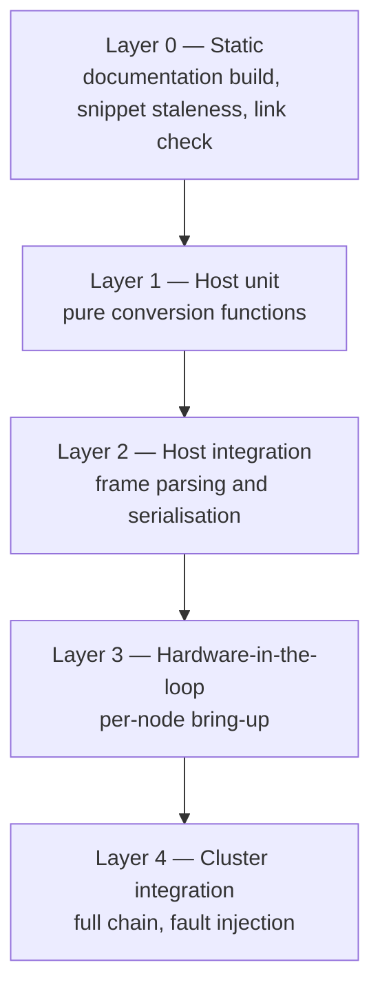

# Test Strategy

!!! danger "This page is a Recommendation, not a description"
    The CIRQUA firmware repository contains **no tests, no test harness and no
    CI**. Nothing described on this page exists today. It is written as a
    proposed approach, in priority order, so that a maintainer can decide what to
    build first. Where a layer already exists — the documentation tooling — it is
    marked as such.

## Why a layered approach

The CIRQUA firmware mixes two very different kinds of logic:

* **Pure arithmetic** — speed-of-sound conversion, cylinder volume,
  dissolved-oxygen compensation, the turbidity quadratic, the conductivity K-factor
  and temperature compensation. All of it is a handful of floats with no I/O.
  This is exactly the code that is cheapest to test and most likely to contain a
  transcription error, because a wrong constant produces a plausible number
  rather than a failure.
* **Concurrency and I/O** — task creation, mutex protection, an ISR, UART
  framing. This is where the consequences of a bug are expensive, and it is where
  host-side unit testing is least effective.

The strategy is therefore: **test the arithmetic exhaustively on the host, and
test the concurrency and framing on the hardware**, accepting that the latter is
observation-based rather than automated.



## Layer 0 — Static checks (already exists)

These are the only automated checks in the project today, and they apply to the
**documentation**, not to the firmware binary.

| Check | Command | Fails when |
|---|---|---|
| Snippet staleness | `python scripts/extract_code_snippets.py --check` | Any extracted region differs from the pinned firmware |
| Strict documentation build | `mkdocs build --strict` | Broken internal link, missing snippet, warning promoted to error |
| Pin consistency | review `sources/firmware-source.yml` and `mkdocs.yml` | The two disagree about the commit |

```bash
python -m pip install -r requirements.txt
python scripts/extract_code_snippets.py --check
mkdocs build --strict
```

!!! note "Recommended addition"
    Add these three commands to a workflow in the **documentation** repository.
    They need no hardware and no firmware toolchain, so the barrier to running
    them is close to zero. Note that they validate *documentation fidelity*,
    not firmware behaviour — a page can be perfectly faithful to code that is
    wrong.

## Layer 1 — Host-side unit tests of the pure conversions

**Recommendation.** The conversion logic currently lives inline inside task
functions, which is exactly what makes it untestable. The smallest change that
unlocks real testing is to lift each expression into a `static inline` function in
the same `.ino` file — no new file, no build change, no behaviour change — and
then have a host-side test include the arithmetic.

| Target | Expression under test | Source |
|---|---|---|
| Distance from echo | `duration * 0.0343f / 2.0f` | Nodes 1, 2, 4 |
| Cylinder volume | `(3.14159f * r * r * h) / 1000.0f` | Nodes 1, 2, 4 |
| Node 1 volume factor | `(int)(litres * 2.0f)` | `Node1.ino` 107 |
| Dissolved oxygen | `compFactor = 1 + (T − 25) * (−0.02)`; `DO = (V/1000) * 8.26 * compFactor` | `Node2.ino` 151–153 |
| Flow rate | `pulses / 5.5` | `Node3.ino` 61 |
| pH | `7 + ((slope*V + offset) − 7) / (1 + 0.02*(T−25))` | `Node4.ino` 477–489 |
| Turbidity | `-1120.4 V² + 5742.3 V − 4353.8`, breakpoints 3.20 V / 0.50 V, clamp [0, 3000] | `Node4.ino` 534–564 |
| Conductivity | `(V * K) / (1 + 0.0185*(T−25)) * 1000` | `Node4.ino` 603–614 |

**Design rules for this layer** — these matter more than the framework choice:

* **Golden vectors, not tolerances where possible.** Compute the expected value
  once by hand from the formula, put it in the test, and assert exact equality.
  This catches a transcription error in the formula itself.
* **Boundary cases are the point.** Test `V` at exactly `0.50`, `0.51`, `3.19`,
  `3.20`, `3.20`, `3.30`, `3.31` for turbidity; `T` at `24.9`, `25.0`, `25.1`
  for every compensation; `duration` at `0`, `1`, the timeout value, and the
  timeout value plus one.
* **Assert the clamp behaviour explicitly.** `ntu` clamped to `[0, 3000]`, EC
  clamped at ≥ 0, height clamped to `[0, TANK_HEIGHT]`.
* **Assert the validity gates**, not just the arithmetic: pH valid only for
  `0.02 ≤ V ≤ 3.30` and `0 ≤ pH ≤ 14`; turbidity and EC valid only for
  `0 ≤ V ≤ 3.30`; DO invalid when the raw count is 0.

**The single highest-value test in this whole strategy** is the turbidity
quadratic's boundary behaviour, because the piecewise structure is the easiest
thing in the firmware to break silently and the hardest to notice from a
display.

## Layer 2 — Host-side frame tests

**Recommendation.** The protocol has no integrity mechanism, which makes the
parsers and serialisers the highest-risk code outside the arithmetic. Both are
pure string work and can be tested without hardware.

| Target | What to assert |
|---|---|
| `validateUpstreamFrame` | Accepts a well-formed frame; rejects one missing `\|node1:`, `\|DO:` or `\|node2:`; accepts the leading-pipe-less `TAV:` form |
| `getFieldFromFrame` (Node 1) | Extracts the last field before `;`; returns `""` for a missing key; handles a key at the very end of the frame |
| `parseNode1Packet` / `parseNode3ReversePacket` (Node 2) | Populates the struct, sets `isValid`, rejects truncated input. Also assert the **known divergence**: the reverse parser looks for `\|FR:` while Node 3 emits `\|FLM:` — a test that encodes the divergence as current behaviour is valuable, because it will fail loudly the day someone fixes one side |
| `cleanUpstreamPacket` (Node 4) | Drops exactly the `AT:` and `AH:` tokens; keeps `TAV`, `DO`, `Temp`, `TBV`, `node1`, `node2`, `FLM`, `node3`; preserves order; handles a frame with no `AT:`/`AH:`; handles a token that merely *contains* but does not start with `AT:` |
| `snprintf` frame formats (all nodes) | Byte-exact comparison against the documented frame strings, including the trailing `;` and the `\n` |
| Buffer overflow paths | A frame longer than the receiver buffer resets the index and drops the frame — assert no partial frame is ever forwarded |

!!! warning "Do not write golden strings by hand from the documentation"
    Generate them from the `snprintf` format strings in the pinned source, so
    the test cannot inherit a documentation error. The formats are listed on
    [Message Format](../communication/message-format.md)) and every one of them
    is quoted from source.

## Layer 3 — Hardware-in-the-loop, per node

**Recommendation.** These are the tests that would catch the failures a
host-side test cannot: wrong pin, wrong baud, disconnected probe, timing.

| Target | Stimulus | Observable |
|---|---|---|
| Node 1 | Bring the whole cluster up, then unplug Node 2 | `STATUS:` leaves `WAITING`, then `ERROR` after `RX_TIMEOUT_MS` |
| Node 1 | Disconnect the ultrasonic head | `TAV` becomes 0, `node1:0`, `STATUS:` shows `WAITING`/`ERROR` depending on link state |
| Node 1 | Set `AT` above `TEMP_ALERT_TH` and `AH` above `HUMID_ALERT_TH` | `STATUS:` cycles `OVERTEMP`, `HI HUMID`, `HOT+HUM` in the documented precedence |
| Node 2 | Disconnect the DS18B20 | `node2:0`, and DO compensation falls back to 25 °C |
| Node 2 | Disconnect the DO probe | `DO:0.00`, `node2:0` |
| Node 2 | Disconnect the DHT11 | `AT:0.00`, `AH:0.00`, `node2:0` |
| Node 3 | Disconnect the flow sensor | `FLM:0.00` while `node3:` stays `1` |
| Node 3 | Cut the upstream link | exactly one fallback frame, then silence until recovery |
| Node 4 | Disconnect the DS18B20 | `[DS18B20] Devices found: 0` at boot; `ST` invalid; pH and EC switch to 25 °C compensation |
| Node 4 | `STATUS` with each probe shorted and open | raw counts move to the rails; validity flags flip as documented |
| Node 4 | `SET:EC_K=0`, `SET:EC_K=-1` | `[ERROR] Invalid value for EC K-Factor.` |
| Node 4 | `SET:EC_K=8.412`, then power-cycle | value survives the reboot; `STATUS` shows it |
| Node 4 | `RESET` | banner reprints with compiled defaults |
| Node 4 SMTP | No Wi-Fi in range | `[ERROR] Wi-Fi Connection Failed!`, node continues, telemetry unaffected |

Procedures for these are written out on
[Hardware Validation](hardware-validation.md)).

## Layer 4 — Cluster integration and fault injection

**Recommendation.** The cluster's real risks are structural, so this layer
should be about topology rather than sensors.

| Inject | Expect |
|---|---|
| Power off Node 2 | Node 1 shows `ERROR`; Node 3 emits one fallback frame; Node 4 forwards a frame with `node1:0`, `node2:0` |
| Power off Node 3 | Node 4 receives nothing; upstream fields absent downstream; `TAV`/`DO` no longer available at the controller |
| Power off Node 4 | The controller receives nothing at all — there is no store-and-forward anywhere |
| Swap two physically similar nodes | **Undetectable.** The protocol carries no node address on the wire; see [Known Limitations](known-limitations.md) |
| Corrupt a byte mid-frame | Frame is forwarded with a garbage field, or dropped on buffer overflow. No checksum means no detection |
| Baud-rate mismatch on one link | Continuous garbage; the receiver's buffer overflows and resets repeatedly |

The second-to-last and last rows are **negative test results by design**: the
purpose of running them is to record the failure mode so that field
troubleshooting knows what to expect, not to prove a fault is caught.

## Proposed test matrix

| Test ID | Level | Target | Expected result |
|---|---|---|---|
| `DOC-001` | Static | Snippet staleness | `extract_code_snippets.py --check` exits 0 for all 41 snippets |
| `DOC-002` | Static | Documentation build | `mkdocs build --strict` exits 0, no broken internal links |
| `DOC-003` | Static | Pin consistency | `sources/firmware-source.yml`, `mkdocs.yml` and the submodule all name `db6d9b8` |
| `DOC-004` | Static | Credential redaction | No real SSID, password or mailbox address in `docs/`; password macros rendered as redacted |
| `CAL-001` | Host | Cylinder volume | `r=59.5, h=178` ⇒ ≈1979.7 L, matching the documented maximum on [Ultrasonic Level](../sensors/ultrasonic.md)) |
| `CAL-002` | Host | Distance conversion | `duration=1000 µs` ⇒ 17.15 cm on all three nodes |
| `CAL-003` | Host | Node 1 volume factor | input 1000 L ⇒ `TAV` = 2000, integer, truncated not rounded |
| `CAL-004` | Host | DO compensation | `T=25` ⇒ factor exactly 1.0; `T=15` ⇒ factor 1.2; `T=35` ⇒ 0.8 |
| `CAL-005` | Host | DO floor | negative computed DO clamps to 0; raw count 0 ⇒ invalid |
| `CAL-006` | Host | Flow rate | 550 pulses in 1 s ⇒ 100.0 L/min |
| `CAL-007` | Host | pH linear model | `slope=3.5, offset=-1.75, V=2.0, T=25` ⇒ 5.250 |
| `CAL-008` | Host | pH compensation | at `T=35`, coefficient = 1.2 and the deviation from 7.0 shrinks by 1.2 |
| `CAL-009` | Host | pH validity | `V=0.01` and `V=3.31` invalid; `V=3.30` valid; pH > 14 invalid |
| `CAL-010` | Host | Turbidity breakpoints | `V≥3.20` ⇒ 0; `V≤0.50` ⇒ 3000; `V=2.00` ⇒ the quadratic value |
| `CAL-011` | Host | Turbidity clamp | quadratic result below 0 or above 3000 is clamped |
| `CAL-012` | Host | Turbidity validity | `V=3.30` valid (saturation is valid), `V=3.31` invalid |
| `CAL-013` | Host | EC conversion | `V=1.5, K=9.997, T=25` ⇒ 14995.5 µS/cm |
| `CAL-014` | Host | EC temperature normalisation | `T=35` divides by 1.185 |
| `CAL-015` | Host | EC zero accepted | `V=0` ⇒ 0 µS/cm and **valid** |
| `FRM-001` | Host | `validateUpstreamFrame` | accepts the real frame; rejects a frame missing any one of the four required keys |
| `FRM-002` | Host | `getFieldFromFrame` | correct value, `""` when absent, last-field-before-`;` handled |
| `FRM-003` | Host | `cleanUpstreamPacket` | removes exactly `AT:` and `AH:`; order and all other fields preserved |
| `FRM-004` | Host | Node 2 divergence | reverse parser does not match the `\|FLM:` frame Node 3 emits — behaviour recorded, not corrected |
| `FRM-005` | Host | Frame formats | `snprintf` output byte-identical to the documented strings, including `;` and `\n` |
| `FRM-006` | Host | Buffer overflow | over-length frame resets the index; no partial frame forwarded |
| `HIL-001` | Hardware | Node 1 status precedence | all ten documented status strings reachable, in precedence order |
| `HIL-002` | Hardware | Node 2 health flag | `node2:1` healthy, `node2:0` with any probe disconnected |
| `HIL-003` | Hardware | Node 3 fallback | one fallback frame on upstream loss, muted until recovery |
| `HIL-004` | Hardware | Node 4 boot banner | calibration banner, three `[ADC]` lines, DS18B20 count, `[DHT11] Initialized` |
| `HIL-005` | Hardware | Node 4 console persistence | `SET:EC_K` survives a power cycle; `RESET` restores defaults |
| `HIL-006` | Hardware | Node 4 SMTP offline behaviour | node continues with no network; telemetry frames unaffected |
| `INT-001` | Integration | Chain break upstream | downstream frames carry `node1:0`/`node2:0`, not stale values |
| `INT-002` | Integration | Node 4 absent | controller receives nothing; no store-and-forward |
| `INT-003` | Integration | Node swap | no detection — recorded as a known limitation, not a defect to fix in test |
| `INT-004` | Integration | Bit corruption | no detection — recorded as a known limitation |

## Sequencing

**Recommendation.**

1. `DOC-001` to `DOC-004` first. They cost an afternoon, need no hardware, and
   protect everything else.
2. `CAL-010` and `CAL-011` next — the turbidity boundaries are the single most
   likely place for a real, silent measurement error.
3. `CAL-*` and `FRM-*` as a block, driven by lifting the arithmetic into named
   functions. That refactor is small, reviewable and behaviour-preserving.
4. `HIL-*` written as procedures on [Hardware Validation](hardware-validation.md))
   rather than as automation, because the value is in the recorded observation,
   not in the pass/fail.
5. `INT-002` and `INT-003` recorded as expected-failure baselines so that field
   diagnosis has something to compare against.

## What this strategy will not give you

* It cannot validate the sensors themselves. A test proves the firmware converts
  a voltage correctly; it says nothing about whether the probe is right. That
  requires calibration against traceable standards — see
  [Calibration](../calibration/index.md)).
* It cannot validate the deployed nodes. Until the firmware reports a commit
  identifier, "which code is on that board in that field" stays a manual
  question.
* It cannot add integrity to the protocol. The missing checksum, sequence number
  and acknowledgement are design gaps, not test gaps; see
  [Known Limitations](known-limitations.md).

## Related

* [Firmware Validation](firmware-validation.md) — what *was* checked.
* [Hardware Validation](hardware-validation.md)) — the Layer 3 procedures.
* [Known Limitations](known-limitations.md) — the gaps a test cannot close.
* [Message Format](../communication/message-format.md)) — the frames to test
  against.